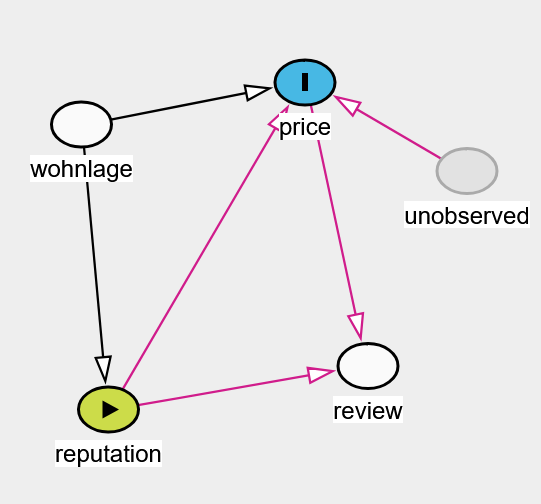

```{r setup, include=FALSE}
knitr::opts_chunk$set(echo = TRUE)
options(scipen = 1, digits = 2)
source("./code/setup.R")

full_refit = F
```

# Introduction
Airbnb is a leading online marketplace that connects homeowners with individuals seeking temporary accommodations. It operates in over 220 countries and regions, making it a global player in the hospitality industry.

Examining the factors influencing Airbnb characteristics, such as prices, is particularly interesting because these are shaped by a variety of factors like location, seasonality and local events. Understanding these influences can provide valuable insights to find the best deals for an apartment and reveal a broader impact of external factors on Airbnb accommodations. Our report will focus on [Airbnb data](https://insideairbnb.com/get-the-data/) from Berlin for the years 2023 and 2024.

## Data description and overview {#overview}

The primary data we used comprised two types of datasets. The first dataset provided information on over 10,000 Airbnb listings in Berlin. This dataset included various attributes related to each listing, such as the listing ID, name, host information, neighborhood, room type, price and more.  
The second dataset contained over 500,000 reviews written in different languages for Airbnb listings in Berlin. These datasets included review IDs, reviewer IDs, listing IDs, the date of the review and the textual content of each comment.

Additionally, we used other datasets containing LOR data for Berlin's neighborhoods, districts and other relevant information, such as the locations of train stations in Berlin. The visualization below displays the various districts of Berlin based on the LOR (Lebensweltlich Orientierter Raum), a unit used by Berlin's municipal services for statistics and planning.

```{r districtsInBerlin, echo=FALSE, message=FALSE, warning=FALSE, cache=!full_refit, fig.cap="Template", fig.align='center', fig.cap= "Districts in Berlin", fig.width=5, fig.height=4}
ggplot(raw) + 
  geom_sf(aes(fill = BEZ_NAME)) +
  scale_fill_manual(values = bezirk_colors, name = "District") +
  theme_void() +
  labs(fill = "Bezirk")
```

Using longitude and latitude coordinates of the Airbnbs, we determined their locations within Berlin's neighborhoods. The plot below shows the distribution of Airbnbs across different districts.

```{r numberOfAirbnbsInBerlin, echo=FALSE, message=FALSE, warning=FALSE, cache=!full_refit, fig.cap="Template", fig.align='center', fig.width=9, fig.height=4, fig.cap="Airbnbs by district in Berlin"}
map_plot <- ggplot(sf_airbnb_by_neighborhood) +
  geom_sf(aes(fill = n), color = "black", size = 0.2) +  # Smaller internal borders
  geom_sf(data = borough_borders, fill = NA, color = "black", size = 1) +  # Larger borders for main boroughs
  scale_fill_gradient(low = "lightyellow", high = "darkred", name = "Number of Airbnbs") +
  theme_void() +
  labs(title = "Number of Airbnbs by district in Berlin",
       fill = "Number of Airbnbs") +
  theme(plot.title = element_text(hjust = 0.5))

proportion_plot <- ggplot(sf_airbnb_by_neighborhood, aes(x = reorder(BEZ_NAME, proportion), y = proportion)) +
  geom_bar(stat = "identity", fill = "skyblue") +
  coord_flip() +
  labs(title = "Proportion of Airbnbs by district in Berlin",
       x = "District",
       y = "Proportion of Airbnbs") +
  theme_minimal() +
  theme(plot.title = element_text(hjust = 0.5))

grid.arrange(map_plot, proportion_plot, ncol=2)
```

By plotting the number or proportion of Airbnbs across Berlin’s districts, it becomes evident that the majority are concentrated in the central areas, with Tempelhof-Schöneberg being a notable exception. Thus the districts on the outside of Berlin have fewer Airbnb listings.

The LOR data provides a high level of granularity, allowing us to go into greater detail by mapping neighborhoods within each district and their associated Number of Airbnbs.

```{r numAirbnbsByLOR, echo=FALSE, message=FALSE, warning=FALSE, cache=!full_refit, fig.cap="Number of Airbnbs by neighborhoods", fig.align='center'}
ggplot(sf_airbnb_by_LOR) +
  geom_sf(aes(fill = n), color = "black", size = 0.2) +  # Smaller internal borders
  geom_sf(data = borough_borders, fill = NA, color = "black", size = 1) +  # Larger borders for main boroughs
  scale_fill_gradient(low = "lightyellow", high = "darkred", name = "Number of Airbnbs") +
  theme_void() +
  labs(fill = "Number of Airbnbs")

```

This figure offers a much more detailed view, revealing that Airbnbs are highly concentrated in the center, except in the Tiergarten-Brandenburger Tor area. The lower density of residential buildings there makes this distribution reasonable.

We can also try to compare the neighborhoods on different criteria, such as the price or the availability of the listings. With this data, we can examine Airbnb prices across various districts.

```{r criteriaByDistrict, echo=FALSE, message=FALSE, warning=FALSE, cache=!full_refit, fig.cap="Template", fig.align='center', fig.cap= "Airbnb prices and availability by district", fig.width=8, fig.height=10}
prices_plot <- ggplot(df_listings_cleaned, aes(x = neighbourhood_group_cleansed, y = price)) +
  geom_boxplot(fill = "lightblue") +
  coord_flip() +
  labs(title = "Prices by district",
       x = "District",
       y = "Price") +
  theme_minimal() +
  theme(plot.title = element_text(hjust = 0.5))

availability_plot <- ggplot(df_listings_cleaned, aes(x = neighbourhood_group_cleansed, y = availability_365)) +
  geom_boxplot(fill = "lightblue") +
  coord_flip() +
  labs(title = "Availability by district",
       x = "District",
       y = "Availability (days per year)") +
  theme_minimal() +
  theme(plot.title = element_text(hjust = 0.5))

grid.arrange(prices_plot, availability_plot, nrow=2)
```

For the prices it is difficult to define clear tendencies, but as an example, listings in Berlin-Mitte have a higher median price.  
Doing the same for availability does not yield any clear result.

Next, we will examine the distribution of the prices to understand how they are spread out.

```{r templateFigure5, echo=FALSE, message=FALSE, warning=FALSE, cache=!full_refit, fig.cap="Price distribution of AirBnBs", fig.align='center'}
ggplot(df_listings_cleaned, aes(x = price)) +
  geom_histogram(aes(y = ..density..), bins = 30, fill = "lightblue", color = "black", alpha = 0.7) +
  geom_density(color = "red", size = 1) +
  theme_minimal() +
  labs(x = "Price",
       y = "Density")
```

The price distribution is clearly a skewed normal distribution, with a peak around 100 euros and a long positive tail. This is typical for rent prices, which often encompass a wide range of categories, from economy to luxury.

We can also take a look at the different types of listings. It appears that the majority are entire homes or apartments, while only a few are private rooms.

```{r airbnbsByRoomType, echo=FALSE, message=FALSE, warning=FALSE, cache=!full_refit, fig.cap="Template", fig.align='center', fig.cap= "Number of Airbnbs by room type", fig.width=5, fig.height=4}
ggplot(df_listings_cleaned, aes(x = room_type)) +
  geom_bar(fill = "skyblue") +
  labs(x = "Room type",
       y = "Number of listings") +
  theme_minimal()
```

Overall, it's clear that there are many more possibilities for visualization, but we focused on specific objectives to keep the project's scope manageable.

## Objectives

1. **Number of Airbnbs by District & Data Overview** (Florian/Eric)
2. **Effect of Airbnb Quantity on Pricing & Data Overview** (Pavlo)
3. **Impact of Bezirk Reputation on Pricing** (Simon)
4. **Influence of Additional Data on Airbnb Pricing & Overview** (Simon)
5. **Analysis of Pricing in Relation to Amenities and Attributes** (Simon)
6. **Sentiment Analysis of Reviews and Titles; Correlation with price and neighborhood** (Eric)

## Airbnb map **TODO remove or change?**

```{r airbnb-map-ggplot, echo=FALSE, message=FALSE, warning=FALSE, cache=!full_refit, fig.cap="Map with ggplot", fig.align='center'}
geo_elect_units %>% 
  ggplot() + 
  geom_sf(
    mapping = aes(geometry = geometry, fill = BEZNAME)
    ) +
  geom_sf(
    data = airbnb_coordinates,
    aes(geometry = geometry),
    size = 1,
    color = "black",
    alpha = .3) +
  theme_bw() +
  theme(
    legend.position = "bottom"
  )+
  scale_fill_manual(
    values = bezirk_colors
  )
```

```{r airbnb-map-plotly, echo=FALSE, message=FALSE, warning=FALSE, cache=!full_refit, fig.cap="Interactive map with plotly with OPNV info", fig.align='center', fig.dim = c(8, 8)}
plot_ly() %>% 
  add_sf(
    data = geo_bezirk, color = ~BEZ_NAME, 
    span = I(0.5), colors = bezirk_colors,
    hoverinfo='skip'
  ) %>% 
  add_sf(
    data = opnv_rails_no_tram_berlin,
    name = 'Rail',
    hoverinfo='skip'
    ) %>% 
  add_sf(
    data = opnv_stations_no_tram_berlin,
    name = 'Station',
    hoverinfo='skip'
  ) %>% 
  add_markers(
    data = df_airbnb,
    x = ~longitude,
    y = ~latitude,
    color = I("black"),
    text = ~str_c(price, " €"),
    hoverinfo='text',
    alpha = 0.3,
    name = 'Airbnb'
  ) %>% layout(
    legend=list(
      x=0,
      xanchor='left',
      yanchor='bottom',
      orientation='h'
    )
  )
```

# Regression of the influence of Bezirk reputation
<h5 class="author">by Simon Schäfer</h5>

```{r, include=FALSE, cache=!full_refit}
q25_mitte <- df_airbnb %>% filter(neighbourhood_group_cleansed == "Mitte") %>% 
  pull(price) %>% quantile(.25)
q75_reinickendorf <- df_airbnb %>% filter(neighbourhood_group_cleansed == "Reinickendorf") %>% 
  pull(price) %>% quantile(.75)
```

We want to estimate the influence the reputation of each *Bezirk* might have on the price for a night.^[Probably the division by *Bezirk* is too rough. A divison into *Kietz* might be more promising to find some meaningful effects.] A first comparison of the median or mean prices per *Bezirk* suggest that there might be some meaningful difference to investigate on (see Table \@ref(tab:airbnb-price-by-bezirk-table)). To stay a night in *Mitte* seems to be twice as expensive as staying in *Reinickendorf*.

```{r airbnb-price-by-bezirk-table, echo=FALSE, message=FALSE, warning=FALSE, cache=!full_refit, results="asis"}
cat(
  "<table>", 
  paste0("<caption>",
         "(#tab:airbnb-price-by-bezirk-table)",
         "Median and mean prices for Airbnbs per night by Bezirk as well as number of Airbnbs in each Bezirk.",
         "</caption>"),
  "</table>", 
  sep ="\n"
  )

df_airbnb %>% rename(Bezirk = neighbourhood_group_cleansed) %>% 
  group_by(Bezirk) %>% 
  summarise("mean price" = mean(price), "median price" = median(price), "#Airbnbs" = n()) %>% 
  datatable(options = list(
    info = FALSE,
    paging = FALSE,
    searching = FALSE,
    order = list(3, 'asc')
  )) %>% 
  formatCurrency(
    columns = c(2, 3),
    currency = " €",
    digits = 2,
    before = FALSE
  )
```

Figure \@ref(fig:airbnb-price-by-bezirk) shows the price for a night at Airbnbs per *Bezirk*. As was already pointed out the prices have a long tail towards higher prices. For the 25 % quantile for *Mitte* we find a value of `r q25_mitte` and for the 75 % quantile for Reinickendorf a value of `r q75_reinickendorf`. Thus for those two extreme *Bezirke* the boxes show almost no overlap. Comparing any other pair we find the boxes overlap more.

```{r airbnb-price-by-bezirk, echo=FALSE, message=FALSE, warning=FALSE, cache=!full_refit, fig.cap="Showing the distribution of the price per Bezirk. Dashed line shows the 25 % quantile for Mitte and the 75 % quantile for Reinickendorf which are very close.", fig.align='center', fig.dim = c(8, 6)}
df_airbnb %>% ggplot(
  aes(
    y = neighbourhood_group_cleansed, 
    x = price, 
    fill = neighbourhood_group_cleansed)
  ) +
  geom_violin() +
  geom_boxplot(width = 0.1, fill = "white") +
  scale_fill_manual(values = bezirk_colors, name = "Bezirk") +
  ylab("Bezirk") +
  xlab("price in €") +
  theme(
    legend.position = "bottom",
    legend.title.position = "top"
  ) +
  # coord_cartesian(xlim = c(0, 250)) +
  geom_vline(xintercept = q25_mitte, lty = 2, color = "black") +
  geom_vline(xintercept = q75_reinickendorf, lty = 2, color = "black")
```

Figure \@ref(fig:airbnb-logprice-by-bezirk) shows the price for a night at Airbnbs per Bezirk on the log scale. For the remainder of this section we will use the logarithm of the Airbnb prices. Most of the price distribuitions look pretty similar. Nevertheless, we will investigate if we can find an effect on the Airbnb prices by something we model as *Bezirk* reputation.

```{r airbnb-logprice-by-bezirk, echo=FALSE, message=FALSE, warning=FALSE, cache=!full_refit, fig.cap="Showing the distribution of the logarithm of the price per Bezirk. Dashed line shows the 25 % quantile for Mitte and the 75 % quantile for Reinickendorf which are very close.", fig.align='center', fig.dim = c(8, 8)}
df_airbnb %>% ggplot(
  aes(
    y = neighbourhood_group_cleansed, 
    x = log_price, 
    fill = neighbourhood_group_cleansed)
  ) +
  geom_violin() +
  geom_boxplot(width = 0.2, fill = "white") +
  scale_fill_manual(values = bezirk_colors, name = "Bezirk") +
  ylab("Bezirk") +
  xlab("log(price)") +
  theme(
    legend.position = "bottom",
    legend.title.position = "top"
  ) +
  geom_vline(xintercept = log(q25_mitte), lty = 2, color = "black") +
  geom_vline(xintercept = log(q75_reinickendorf), lty = 2, color = "black")
```

## Disclaimer

This section was written parallel to the personal revision of Bayesian regression methods. Thus one finds some discussion of DAGs and visualisation of simulated data - not only the real data from the Airbnb dataset. In the first part of the chapter one finds a step by step evolution for the first steps of the model used later with some explanations why this approach might be of value.

**tl;dr**

* This approach is valuable if one tries to estimate causal effects.
* This approach will not lead to the best predictive model.
* This approach can be used outside of a Bayesian framework as well.^[With the modern computation power at hand it is possible to follow a Bayesian path if one prefers the Bayesian probability theory premises. But one has to keep in mind that longer calculations consume more energy and thus probably contribute to higher CO<sub>2</sub> emissions.]

## Simulation of base models

```{r, include=FALSE, cache=!full_refit}
n <- 6306
mean <- log(100)
sd <- 0.5

sample_mu <- rnorm(n, mean, sd)
sample_sigma <- runif(n, 0, 1)
prior_h <- rnorm( n , sample_mu , sample_sigma )

sim_base_model <- tibble(
  sim_base_point_prior = rnorm(n, mean, sd),
  sim_base_distr_prior = prior_h,
  original = df_airbnb$log_price
)

n_bezirk <- 12
bezirke <- sample(1:12, n, replace = TRUE)
b_bezirk_reputation <- rnorm(12, 0, 0.5)
b_bezirk_reputation_distr <- rnorm(n, b_bezirk_reputation[bezirke], 0.2)
prior_bezirke = rnorm(n, sample_mu+b_bezirk_reputation_distr, sample_sigma)

sim_reputation_only_model <- tibble(
  bezirk = bezirke,
  sim_reputation = prior_bezirke,
  original = df_airbnb$log_price
)
```

Following @mcelreath_statistical_2020 book on bayesian statistics we start by specify two base models and simulate data from those to compare it with the real data. Simulating data and comparing it to real data is a good possibility to get a feeling for plausible priors [@mcelreath_statistical_2020, p. 85]. 

The most basic model possible assumes that the price just follows a given distribution (e.g. normal distribution) and that there are no influences on price. This is probably not correct. An equal approach on simulation comes from a model where we believe that the price is dependent on some variables but those variables were not measured. The corresponding DAG (directed acyclic graph) is shown in Figure \@ref(fig:dag-base-model).

```{r dag-base-model, echo=FALSE, message=FALSE, warning=FALSE, cache=!full_refit, fig.cap="DAG for most basic model", fig.align='center', fig.dim = c(4, 4)}
dag <- dagify(
  price ~ u,
  latent = "u",
  outcome = "price",
  labels = c(price = "price", u = "unobserved")
) %>% tidy_dagitty()

(ggdag_status(dag, use_labels = "label", text = FALSE) + 
  scale_fill_manual(
  labels = c("exposure", "outcome"), 
  values = c("#e41a1c", "#377eb8")
  ) +
  scale_color_manual(
  labels = c("exposure", "outcome"), 
  values = c("#e41a1c", "#377eb8")
  ) +
  theme_dag() +
  theme(
    legend.position = "bottom"
  )) %>% plot_arrows_on_top()
```

As starting values for the base model a mean price of 100 € was chosen assuming (before inspecting the real data) this might be a realistic price. This corresponds to a value of `r log(100)` on the log scale. As standard deviation \(0.5\) was chosen. The statistical model is shown in Equation \@ref(eq:base-model). 

\begin{equation} 
log(price) \sim Normal(\mu, \sigma) \\
\mu = 4.61 \\
\sigma = 0.5
(\#eq:base-model)
\end{equation} 

The statistical model formulated in Equation \@ref(eq:base-model) uses point-wise defined "priors" - and thus is not a bayesian but a frequentist model. Compare this to Equation \@ref(eq:base-model-bayesian). Here $\mu$ and $\sigma$ are distributions - not single values. The mean and standard deviation chosen in the frequentist model are both chosen in the prior for $\mu$ and $\sigma$ got a completly new distribution.

\begin{equation} 
log(price) \sim Normal(\mu, \sigma) \\
\mu \sim Normal(4.61, 0.5) \\
\sigma \sim Uniform(0, 1)
(\#eq:base-model-bayesian)
\end{equation} 

Since $\mu$ and $\sigma$ vary in the bayesian model \@ref(eq:base-model-bayesian) we find the simulated price range to be wider compared with the simulations from the frequentist model \@ref(eq:base-model). The results can be seen in Figure \@ref(fig:price-distribution-simulated). By accident the choice for the standard deviation produced a simulated distribution that is almost as wide as the real data for the baysian prior. For the frequentist prior the simulated distribution is even narrower and thus the prior standard deviation might be a little bit larger if it should be less restrictive.

```{r price-distribution-simulated, echo=FALSE, message=FALSE, warning=FALSE, cache=!full_refit, fig.cap="Distribution of prices on the log scale for real data and data simulated from priors", fig.align='center'}
sim_base_model %>% 
  pivot_longer(everything()) %>% 
  mutate(
    name = factor(
      name, 
      levels = c("original", "sim_base_point_prior", "sim_base_distr_prior"), 
      labels = c("original data", "simulated data frequentist", "simulated data bayesian")
      )) %>% 
  ggplot() +
  geom_density(aes(x = value), fill = "#AACCFF") +
  facet_wrap(
    ~name, nrow = 3
    ) +
  xlab("log(price)")
```

Note, that the DAG shown in Figure \@ref(fig:dag-base-model) is corresponding to both equations. The important role of DAGs is not to define an exact statistic model but to show the beliefs about causual effects that generate the real data. It is benefitial to create a graphical represenation of the assumed casual model to select which covariables to include in the statistical model. In a DAG one can identify e.g. fork-, pipe- or collider-constallations and identify backdoor paths. Which covariable to include or exclude depends on the effect one tries to estimate (to investigate a hypothesis).

Since the goal is to estimate a possible influence of the *Bezirk* reputation it should be included in the DAG explicitly. Since there is no measurement of the *Bezirk* reputation (e.g. from a conducted survey) it is an unobserved (latent) variable. Because *Bezirk* reputation is target for our investigation we will declare it as our exposure (treatment). Moving a Airbnb from one *Bezirk* to another physically is difficult.^[Probably the *Bezirk* borders won't change in near future as well. But they do rarely.] So it might seem odd to think of *Bezirk* reputation as the treatment. But using the posterior the effect of changing the district can be calculated easily. Figure \@ref(fig:dag-reputation-only-model) shows the corresponding DAG.

```{r dag-reputation-only-model, echo=FALSE, message=FALSE, warning=FALSE, cache=!full_refit, fig.cap="DAG for most basic model", fig.align='center', fig.dim = c(6, 4)}
dag <- dagify(
  price ~ u + reputation,
  latent = c("u"),
  exposure = "reputation",
  outcome = "price",
  labels = c(price = "price", u = "unobserved", reputation = "reputation")
) %>% tidy_dagitty()

(ggdag_status(dag, use_labels = "label", text = FALSE) + 
    scale_fill_manual(
      labels = c("exposure", "latent", "outcome"), 
      values = c("#e41a1c", "#4daf4a", "#377eb8")
    ) +
    scale_color_manual(
      labels = c("exposure", "latent", "outcome"), 
      values = c("#e41a1c", "#4daf4a", "#377eb8")
    ) +
    theme_dag() +
    theme(
      legend.position = "bottom"
    )) %>% plot_arrows_on_top()
```

A corresponding statistical representation can be seen in Equation \@ref(eq:reputation-model). The simulated distribution of log prices can be seen in Figure \@ref(fig:price-distribution-simulated-reputation). The simulated distributions are spread out wider than for real data (see Figure \@ref(fig:airbnb-logprice-by-bezirk)) so that there are multiple pairs of districts where the boxes do not overlap. Thus one can assume the effect of *Bezirk* reputation be smaller than assumed in this priors.

\begin{equation} 
log(price) \sim Normal(\mu, \sigma) \\
\mu = a + Rep[i] \\
a \sim Normal(4.61, 0.5) \\
Rep[i] \sim Normal(0, 0.5) \\
\sigma \sim Uniform(0, 1)
(\#eq:reputation-model)
\end{equation} 

```{r price-distribution-simulated-reputation, echo=FALSE, message=FALSE, warning=FALSE, cache=!full_refit, fig.cap="Distribution of prices on the log scale simulated from priors including reputation effect for 12 imaginary districts", fig.align='center', fig.dim = c(8, 8)}
sim_reputation_only_model %>% 
  select(-original) %>% 
  mutate(bezirk = str_c("Bezirk ", str_pad(bezirk, 2, "0", side = "left"))) %>% 
  ggplot(
    aes(
      x = sim_reputation,
      y = bezirk,
      fill = bezirk
    )) +
  geom_violin() +
  geom_boxplot(width = 0.2, fill = "white") +
  scale_fill_discrete(guide="none") +
  ylab(NULL) +
  xlab("log(price)")
```

## Dicussion of exemplary backdoor paths

A possible variable to include in the final model is the quality of residental area (*Wohnlage*) [@noauthor_wohnlagen_2024]. A high amount good *Wohnlage* in a *Bezirk* might influence its reputation. It might influence the rent or purchuse price of a flat used as Airbnb as well. So the host has to ask for higher payment per night to compensate the rent or loan installment he has to pay and maybe wants to profit by a possible good reputation of the *Bezirk* to increase his income a little more - raising the price per night once again.

In \@ref(fig:dag-reputation-model-wohnlage) one can see a model with *Wohnlage* added as a covariable. Since *Wohnlage* influences reputation as well as price there is fork pattern. *Wohnlage* is a classical confounder [@mcelreath_statistical_2020, p. 189].

```{r, include=FALSE, cache=!full_refit}
dag <- dagify(
  price ~ u + reputation + wohnlage,
  reputation ~ wohnlage,
  latent = c("u"),
  exposure = "reputation",
  outcome = "price",
  labels = c(price = "price", u = "unobserved", reputation = "reputation", wohnlage = "Wohnlage")
) %>% tidy_dagitty()
```

```{r dag-reputation-model-wohnlage, echo=FALSE, message=FALSE, warning=FALSE, cache=!full_refit, fig.cap="DAG for model with reputation and Wohnlage", fig.align='center', fig.dim = c(6, 4)}
(ggdag_status(dag, use_labels = "label", text = FALSE) + 
  scale_fill_manual(
  labels = c("exposure", "outcome", "latent"), 
  values = c("#e41a1c", "#377eb8", "#4daf4a"),
  limits = c("exposure", "outcome", "latent")
  ) +
  scale_color_manual(
  labels = c("exposure", "outcome", "latent"), 
  values = c("#e41a1c", "#377eb8", "#4daf4a"),
  limits = c("exposure", "outcome", "latent")
  ) +
  theme_dag() +
  theme(
    legend.position = "bottom"
  )) %>% plot_arrows_on_top()
```

Using a tool called dagitty [@textor_robust_2016] one can draw DAGs in the browser. Furthermore, one can get a minimal adjustment set and information on which assumptions about conditional independence would be testable if the model specified is correct. It is possible to indicate additional covariables one intends to use to check if one opens any backdoor path this way. The code for the DAG can be used to display DAGs in R as well (e.g. with the **ggdag** package). Figure \@ref(fig:dag-reputation-model-wohnlage-adjustment-set) shows that *Wohnlage* is part of the so called minimal adjustment set. Thus it has to be included to estimate (either the total or direct) causual effect.

```{r dag-reputation-model-wohnlage-adjustment-set, echo=FALSE, message=FALSE, warning=FALSE, cache=!full_refit, fig.cap="DAG for model with reputation and Wohnlage showing minimal adjustment set membership", fig.align='center', fig.dim = c(6, 4)}
(ggdag_adjustment_set(dag, use_labels = "label", text = FALSE, shadow = T) + 
  theme_dag() +
  theme(
    legend.position = "bottom"
  )) %>% plot_arrows_on_top()
```

One could also be tempted to include the results of the review sentiment analysis in the regression model. Assuming that reviews are influenced by peoples expectations and their actual experience with an Airbnb visit one can argue that is influenced by price as well as by *Bezirk* reputation. If the price is high expectations are high as well. If the reputation of the *Bezirk* is good the expectations might be high even if the price is modest. The resulting model can be seen in Figure \@ref(fig:dag-reputation-model-wohnlage-reviews).

```{r, include=FALSE, cache=!full_refit}
dag <- dagify(
  price ~ u + reputation + wohnlage,
  reputation ~ wohnlage,
  review ~ reputation + price,
  latent = c("u"),
  exposure = "reputation",
  outcome = "price",
  labels = c(price = "price", u = "unobserved", reputation = "reputation", wohnlage = "Wohnlage", review = "review")
) %>% tidy_dagitty()
```

```{r dag-reputation-model-wohnlage-reviews, echo=FALSE, message=FALSE, warning=FALSE, cache=!full_refit, fig.cap="DAG for model with reputation, Wohnlage and review", fig.align='center', fig.dim = c(6, 4)}
(ggdag_status(dag, use_labels = "label", text = FALSE) + 
  scale_fill_manual(
  labels = c("exposure", "outcome", "latent"), 
  values = c("#e41a1c", "#377eb8", "#4daf4a"),
  limits = c("exposure", "outcome", "latent")
  ) +
  scale_color_manual(
  labels = c("exposure", "outcome", "latent"), 
  values = c("#e41a1c", "#377eb8", "#4daf4a"),
  limits = c("exposure", "outcome", "latent")
  ) +
  theme_dag() +
  theme(
    legend.position = "bottom"
  )) %>% plot_arrows_on_top()
```

Once again the adjustment set only includes *Wohnlage*. Since *review* is influenced by the price and reputation it is a collider. In contrast to a fork a collider backdoor path is closed as long as the collider is not part of the model. Thus it should not be included in the model (see Figure \@ref(fig:dag-reputation-model-wohnlage-reviews-adjustment-set)).
 
```{r dag-reputation-model-wohnlage-reviews-adjustment-set, echo=FALSE, message=FALSE, warning=FALSE, cache=!full_refit, fig.cap="DAG for model with reputation, Wohnlage and review showing minimal adjustment set membership", fig.align='center', fig.dim = c(6, 4)}
(ggdag_adjustment_set(dag, use_labels = "label", text = FALSE, shadow = T) + 
  theme_dag() +
  theme(
    legend.position = "bottom"
  )) %>% plot_arrows_on_top()
```

It is important to understand that variables that are

* neither the treatment
* nor the exposure
* nor a variable marked as adjusted

are assumed to be not included in the model.

If one wants to test if an additional covariable would open backdoors one can use the `ggdag_adjust()` function. Resulting backdoor paths are displayed dashed. In Figure \@ref(fig:dag-reputation-model-wohnlage-reviews-collider) one can see that adjusting for reviews (including it in the model) opens a lot of non causal paths.^[I would recommand to use the dagitty web app instead. There the paths directly affected by the collider simply get coloured red:<br>
{width=50%}]

```{r dag-reputation-model-wohnlage-reviews-collider, echo=FALSE, message=FALSE, warning=FALSE, cache=!full_refit, fig.cap="DAG for model with reputation, Wohnlage and review with manual non minimal adjustment set membership showing opened backdoor paths", fig.align='center', fig.dim = c(6, 4)}
(ggdag_adjust(dag, use_labels = "label", text = FALSE, var = c("wohnlage", "review")) + 
    theme_dag() +
    theme(
      legend.position = "right"
    )) %>% plot_arrows_on_top()
```

The step by step model builing description ends at this point. In the next section the full model used for the regression analysis will be presented.

## Full model

The full model includes covariables of three types and from various sources. The covariables framed by a green rect (see Figure \@ref(fig:dag-reputation-full-model)) are features given by the Airbnb overview dataset. They yield basic information about how many people can stay there, how many rooms are there and if the Airbnb is an entire flat, a single room in a flat or a single room in a hotel.

The covariables framed by a purple rect are coming from various external data sources and were assigned to the flats by location. Most of these information is based on datasets with geographical information aggregated by *LOR* and *Urnenwahlbezirk* or calculated distances to spots of interest. We assume that distance to train stations (especially Hauptbahnhof) might influence the price but not the reputation of a district. We include distance to public toilets even though we don't assume a measurable influence on price.

Last we added more detailed information about the amenities in the Airbnbs that we extracted from the full detailed Airbnb dataset.

```{r dag-reputation-full-model, echo=FALSE, message=FALSE, warning=FALSE, cache=!full_refit, fig.cap="Full DAG.", fig.align='center', fig.dim = c(8, 8)}
gg_temp <- ((ggdag_status(full_dag, use_labels = "name", text = FALSE) + 
    scale_fill_manual(
      labels = c("exposure", "outcome", "latent"), 
      values = c("#e41a1c", "#377eb8", "#4daf4a"),
      limits = c("exposure", "outcome", "latent")
    ) +
    scale_color_manual(
      labels = c("exposure", "outcome", "latent"), 
      values = c("#e41a1c", "#377eb8", "#4daf4a"),
      limits = c("exposure", "outcome", "latent")
    ) +
    theme_dag() +
    theme(
      legend.position = "bottom"
    )) %>% plot_arrows_on_top() +
  geom_rect(aes(xmin = 0, xmax = 1, ymin = 0.6, ymax = 0.875), fill = NA, color = "purple", size = 2) +
  geom_rect(aes(xmin = 0, xmax = 0.65, ymin = 0.3, ymax = 0.55), fill = NA, color = "green", size = 2) +
  geom_rect(aes(xmin = 0.68, xmax = 1, ymin = 0.3, ymax = 0.575), fill = NA, color = "orange", size = 2)
  ) %>% layer_on_bottom(5) %>% layer_on_bottom(6) %>% layer_on_bottom(7)
plot(gg_temp)
```

It seems plausible that crime rates influence the reputation of an district. And there are theories predicting higher crime rated for regions with lower living standards. Thus we get a new backdoor path there - but it is already closed when the model is adjusted for *Wohnlage* (see Figure \@ref(fig:dag-reputation-full-model-minimal-adjustment-set)). Crime rate is not included in the final models because it possibly explaines variance of *Bezirk* reputation and thus lower the covariance to price (precision parasite effect) as well as amplicate the bias of unobserved confounds between exposure and target.^[Closing all backdoor paths is not the only criteria to choose covariables on. There are other effects to consider.]

```{r dag-reputation-full-model-minimal-adjustment-set, echo=FALSE, message=FALSE, warning=FALSE, cache=!full_refit, fig.cap="Full DAG with minimal adjustment set. Only Wohnlage is nedded to close backdoor paths.", fig.align='center', fig.dim = c(8, 8)}
(ggdag_adjustment_set(full_dag, use_labels = "name", text = FALSE, shadow = T) + 
  theme_dag() +
  theme(
    legend.position = "bottom"
  )) %>% plot_arrows_on_top() 
```

Indicating that all variables but reviews should be included in the model shows no non-closed backdoor paths (see Figure \@ref(fig:dag-reputation-full-model-adjustment-set)). Thus the model might yield an unconfounded estimator for the effect of the *Bezirk* reputation. The reason to include other covariables than those from the minimal adjustment set is that we hope to reduce the variance in the Airbnb price by reducing the amount of unobserved sources of variance. Hopefully this leads to narrower posterior predictions to identify a possible causual effect of the *Bezirk* reutation.

```{r dag-reputation-full-model-adjustment-set, echo=FALSE, message=FALSE, warning=FALSE, cache=!full_refit, fig.cap="Full DAG with all covariables included in the model marked as adjusted. No new backdoor paths opened.", fig.align='center', fig.dim = c(8, 8)}
(ggdag_adjustment_set(full_dag_adjusted, use_labels = "name", text = FALSE, shadow = T) +
  theme_dag() +
  theme(
    legend.position = "bottom",
    strip.background = element_blank(),
    strip.text.x = element_blank()
  )) %>% plot_arrows_on_top()
```

## Regression

```{r, include=FALSE, cache=!full_refit}
# base model
base_model_post <- readRDS("./saved_objects/base_model_post.rds")
base_model_student_post <- readRDS("./saved_objects/base_model_student_post.rds")

max_pred_base <- base_model_post %>% 
  mutate(price = exp(rnorm(1000, mu, sigma))) %>% pull(price) %>% max()
max_pred_base_student <- base_model_student_post %>% 
  mutate(price = exp(rstudent(1000, 2, mu, sigma))) %>% pull(price) %>% max()
sigma_base_model <- mean(base_model_post$sigma)
sigma_base_model_student <- mean(base_model_student_post$sigma)

# minimal adjustement set
base_model_reputation_wohnlage_post <- readRDS("./saved_objects/base_model_reputation_wohnlage_post.rds")
base_model_reputation_wohnlage_student_post <- readRDS("./saved_objects/base_model_reputation_wohnlage_student_post.rds")

# full model
full_model_post <- readRDS("./saved_objects/full_model_post.rds")
full_model_verbose_post <- readRDS("./saved_objects/full_model_verbose_post.rds")
```

### Baseline models

We will begin with the presentation of the most basic models and demonstrate some common visualizations for Bayesian regression reports. Precisely, we will...

* distinguish between parameter estimates and posterior predictions.
* distinguish between parameter estimations and predicted effect (by contrating predictions).
* show the influence of robust regression assuming student distributed prices instead of normal distributed ones (not bound to Bayesian methods).

In Figure \@ref(fig:base-model-4x4) one can see the difference between the parameter estimation (distribution) of the mean price (left) and the posterior predictions for the distribution of Airbnb prices (right) for the model represented by Figure \@ref(fig:dag-base-model). It is clear that the distribution of the prices is much wider than the estimated distribution of the mean value since one has to exponentiate the result of the random sampling around the mean.

Comparing the results from the model with $Normal(\mu, \sigma)$ distributed prices (top) with the results from the model that assumed $Student(2, \mu, \sigma)$ distributed prices (bottom) we find lower mean price for the student model. For the price distributions we find more Airbnb prices in the range (200 €, 400 €) for the normal model. In contrast we find thicker tails for the student model so more predictions about Airbnb prices higher than 400 €. The mean $\sigma$ value for the normal model is `r sigma_base_model` and for the student model `r sigma_base_model_student`. The maximum price for an Airbnb is `r max_pred_base` € and respective `r format(max_pred_base_student, scientific=FALSE, big.mark="_")` €. For the studnet distribution we find more Airbnb prices predicted to be  around 0 €.

```{r base-model-4x4, echo=FALSE, message=FALSE, warning=FALSE, cache=!full_refit, fig.cap="Comparing parameter estimations and posterior predictions (left vs right) and assumed normal and student distributed prices (top vs bottom). The x-axis is clipped at 800 €.", fig.align='center', fig.dim = c(8, 8)}
g_param_norm <- base_model_post %>% 
  mutate(price = exp(mu)) %>% 
  ggplot(aes(x = price)) +
  stat_halfeye(.width = c(.90, .5)) +
  labs(x=NULL, y=NULL) +
  coord_cartesian(xlim = c(100, 108))

g_pred_norm <- base_model_post %>% 
  mutate(price = exp(rnorm(1000, mu, sigma))) %>% 
  ggplot(aes(x = price)) +
  stat_halfeye(.width = c(.90, .5)) +
  labs(x=NULL, y=NULL) +
  xlim(0, 800)

g_param_student <- base_model_student_post %>% 
  mutate(price = exp(mu)) %>% 
  ggplot(aes(x = price)) +
  stat_halfeye(.width = c(.90, .5)) +
  labs(x=NULL, y=NULL) +
  coord_cartesian(xlim = c(100, 108))

g_pred_student <- base_model_student_post %>%
  rowwise() %>% mutate(price = exp(rstudent(1, 2, mu, sigma))) %>% 
  ggplot(aes(x = price)) +
  stat_halfeye(.width = c(.90, .5)) +
  labs(x=NULL, y=NULL) +
  xlim(0, 800)

p <- list(g_param_norm, g_pred_norm, g_param_student, g_pred_student)

yleft = gridtext::richtext_grob("density", rot=90)
bottom = gridtext::richtext_grob(
  text = 'price in €'
)

gridExtra::grid.arrange(
  grobs = p, 
  nrow = 2, 
  left = yleft, bottom = bottom
)
```

In Figure \@ref(fig:base-model-rep-wol-parameter) on can compare the parameter estimation for a normal and a student distributed model once more. The DAG corresponding to the model these results are based on is shown in Figure \@ref(fig:dag-reputation-model-wohnlage). The means are estimated for each *Bezirk* and according to each value of *Wohnlage*. We can see that the means for highest value of *Wohnlage* are seperated from those of the lower two values. For the latter there is substantial overlap of the distributions. The separation seems a little bit better for the student model. It is also clear that some parameter distributions show no overlap comparing the same *Wohnlage* among districts.

```{r base-model-rep-wol-parameter, echo=FALSE, message=FALSE, warning=FALSE, cache=!full_refit, fig.cap="Comparing parameter estimations for assumed normal and student distributed prices (top vs bottom).", fig.align='center', fig.dim = c(8, 8)}
g_param_norm <- base_model_reputation_wohnlage_post %>% 
  pivot_wider(names_from = "wohnlage", values_from = "delta", names_prefix = "wol_") %>% 
  mutate(
    price_wol_1 = exp(reputation+bE*(wol_1)),
    price_wol_2 = exp(reputation+bE*(wol_1+wol_2)),
    price_wol_3 = exp(reputation+bE*(wol_1+wol_2+wol_3))
    ) %>% pivot_longer(cols = starts_with("price_"), values_to = "price", names_prefix = "price_wol_", names_to = "wohnlage") %>% 
  mutate(bezirk = bezirk_levels[bezirk]) %>% 
  ggplot(aes(x = price, y = bezirk, fill = wohnlage)) +
  stat_slab(.width = c(.90, .5), alpha = .5) +
  labs(x=NULL, y=NULL)

g_param_student <- base_model_reputation_wohnlage_student_post %>% 
  pivot_wider(names_from = "wohnlage", values_from = "delta", names_prefix = "wol_") %>% 
  mutate(
    price_wol_1 = exp(reputation+bE*(wol_1)),
    price_wol_2 = exp(reputation+bE*(wol_1+wol_2)),
    price_wol_3 = exp(reputation+bE*(wol_1+wol_2+wol_3))
  ) %>% pivot_longer(cols = starts_with("price_"), values_to = "price", names_prefix = "price_wol_", names_to = "wohnlage") %>% 
  mutate(bezirk = bezirk_levels[bezirk]) %>% 
  ggplot(aes(x = price, y = bezirk, fill = wohnlage)) +
  stat_slab(.width = c(.90, .5), alpha = .5) +
  labs(x=NULL, y=NULL)

ggpubr::ggarrange(
  plotlist = list(g_param_norm, g_param_student), 
  nrow = 2,
  common.legend = TRUE, legend = "bottom"
)
```

To get an estimation of the causual effect of the *Bezirks* reputation it is necessary to inspect contrast plots (see Figure \@ref(fig:base-model-rep-wol-parameter-contrasts)). To limit the amount of comparisons the districts *Mitte* (high prices), *Neukölln* and *Tempelhof-Schöneberg* (medium prices) as well as *Reinickendorf* (low prices) have been selected. It can be seen that the mean price (aggregated over all *Wohnlagen*^[To be correct one would have to select prices according to the distribution of the *Wohnlage* values per district. It was assumed that they all make up one third in each distric to simplify the analysis.]) differ by more than 10 € for all comparisons but for the apir *Neukölln* and *Tempelhof*. One could conclude that teleporting an Airbnb from *Reinickendorf* to *Mitte* allows for a price increase of around 50 €.

```{r base-model-rep-wol-parameter-contrasts, echo=FALSE, message=FALSE, warning=FALSE, cache=!full_refit, fig.cap="Comparing predictions for mean prices aggregated over values of *Wohnlagen*.", fig.align='center', fig.dim = c(8, 6)}
bdat <- base_model_reputation_wohnlage_post %>% 
  pivot_wider(names_from = "wohnlage", values_from = "delta", names_prefix = "wol_") %>% 
  mutate(
    price_wol_1 = exp(reputation+bE*(wol_1)),
    price_wol_2 = exp(reputation+bE*(wol_1+wol_2)),
    price_wol_3 = exp(reputation+bE*(wol_1+wol_2+wol_3))
  ) %>% pivot_longer(cols = starts_with("price_"), values_to = "price", names_prefix = "price_wol_", names_to = "wohnlage") %>% 
  mutate(bezirk = bezirk_levels[bezirk]) %>% 
  filter(bezirk %in% c("Mitte", "Tempelhof-Schöneberg", "Neukölln", "Reinickendorf")) %>% 
  select(bezirk, price, wohnlage, .draw, .chain, .iteration) %>% 
  pivot_wider(names_from = bezirk, values_from = price, names_prefix = "price_")
  
adat <- bdat %>% 
  select(starts_with("price_"))

# Get column names
nm1 <- outer(colnames(adat), colnames(adat), paste, sep="_-_")

# Indices for lower triangular elements (excluding diagonal)
indx1 <- which(lower.tri(nm1, diag=TRUE))

# Calculate pairwise differences
res <- outer(1:ncol(adat), 1:ncol(adat), function(x, y) adat[, x] - adat[, y])

# Set column names for the resulting dataframe
colnames(res) <- nm1
res1 <- res[-indx1]

area <- 10
res1 %>% bind_cols(
  bdat %>% select(-starts_with("price_")) # %>% rename(wohnlage = name)
) %>% 
  pivot_longer(starts_with("price_"), values_to = "price_diff") %>% 
  mutate(
    name = str_replace(name, "_-_", " - ") %>% str_remove_all("price_")
  ) %>% 
  ggplot(aes(x = price_diff, y = name, fill = stat(abs(x) > area))) +
  stat_halfeye() +
  geom_vline(xintercept = c(-area, area), linetype = "dashed") +
  scale_fill_manual(values = c("gray80", "skyblue")) +
  labs(x="difference of mean price in €", y=NULL) +
  theme(
    legend.position = "bottom"
  )
```

Next we will inspect how this difference in mean price is related to the prediction of the Airbnb price distribution (see Figure \@ref(fig:base-model-rep-wol-predictions)). Here the price distributions for the normal and student model look pretty similar. The thicker tails for the student model are barely visible. But the maximum predicted price is (again) much to high and there are many predictions around 0 €. Thus we won't use the student modeling approach for the full model later.

The price distributions for all values of *Wohnlage* almost totally overlap even though the parameter estimations for their means were good distinguishable. Beside from the distributions for *Reinickendorf* and *Marzahn-Hellersdorf* (which are a little bit more left skewed) they all look pretty similar as well in this plot.

```{r base-model-rep-wol-predictions, echo=FALSE, message=FALSE, warning=FALSE, cache=!full_refit, fig.cap="Comparing posterior predictions for assumed normal and student distributed prices (top vs bottom). The x-axis is clipped by 500 €.", fig.align='center', fig.dim = c(8, 8)}
g_pred_norm <- base_model_reputation_wohnlage_post %>% 
  pivot_wider(names_from = "wohnlage", values_from = "delta", names_prefix = "wol_") %>% 
  rowwise() %>% 
  mutate(
    price_wol_1 = exp(rnorm(1, reputation+bE*(wol_1), sigma)),
    price_wol_2 = exp(rnorm(1, reputation+bE*(wol_1+wol_2), sigma)),
    price_wol_3 = exp(rnorm(1, reputation+bE*(wol_1+wol_2+wol_3), sigma))
  ) %>% pivot_longer(cols = starts_with("price_"), values_to = "price", names_prefix = "price_wol_", names_to = "wohnlage") %>% 
  mutate(bezirk = bezirk_levels[bezirk]) %>% 
  ggplot(aes(x = price, y = bezirk, fill = wohnlage)) +
  stat_slab(.width = c(.90, .5), alpha = .5) +
  labs(x=NULL, y=NULL) +
  xlim(0, 500)

g_pred_student <- base_model_reputation_wohnlage_student_post %>%
  pivot_wider(names_from = "wohnlage", values_from = "delta", names_prefix = "wol_") %>% 
  rowwise() %>% 
  mutate(
    price_wol_1 = exp(rstudent(1, 2, reputation+bE*(wol_1), sigma)),
    price_wol_2 = exp(rstudent(1, 2, reputation+bE*(wol_1+wol_2), sigma)),
    price_wol_3 = exp(rstudent(1, 2, reputation+bE*(wol_1+wol_2+wol_3), sigma))
  ) %>% pivot_longer(cols = starts_with("price_"), values_to = "price", names_prefix = "price_wol_", names_to = "wohnlage") %>% 
  mutate(bezirk = bezirk_levels[bezirk]) %>% 
  ggplot(aes(x = price, y = bezirk, fill = wohnlage)) +
  stat_slab(.width = c(.90, .5), alpha = .5) +
  labs(x=NULL, y=NULL) +
  xlim(0, 500)

ggpubr::ggarrange(
  plotlist = list(g_pred_norm, g_pred_student), 
  nrow = 2,
  common.legend = TRUE, legend = "bottom"
)
```

To investigate the difference of the predicted price distributions we once again create a contrast plot (see Figure \@ref(fig:base-model-rep-wol-predictions-contrasts)). One can see that the distributions of price differences have an considerable amount of mass on both sides of zero. Nevertheless, the probability to get a lower price for an Airbnb in *Reinickendorf* than in *Mitte* is predicted as 75.6 %. The probability to safe more than 10 €per night is still 70.4 %. Even though it was hard to see any difference without the contrast plot and with zero near to the peak of probability distributions we find results that are meaningful for in reality.

```{r base-model-rep-wol-predictions-contrasts, echo=FALSE, message=FALSE, warning=FALSE, cache=!full_refit, fig.cap="Contrast plot of price difference among four districts. Positive values: one safes money if one books an Airbnb in the *Bezirk* named right of the minus sign.", fig.align='center', fig.dim = c(8, 6)}
bdat <- base_model_reputation_wohnlage_post %>% 
  pivot_wider(names_from = "wohnlage", values_from = "delta", names_prefix = "wol_") %>%
  rowwise() %>% 
  mutate(
    price_wol_1 = exp(rnorm(1, reputation+bE*(wol_1), sigma)),
    price_wol_2 = exp(rnorm(1, reputation+bE*(wol_1+wol_2), sigma)),
    price_wol_3 = exp(rnorm(1, reputation+bE*(wol_1+wol_2+wol_3), sigma))
  ) %>% pivot_longer(cols = starts_with("price_"), values_to = "price", names_prefix = "price_wol_", names_to = "wohnlage") %>% 
  mutate(bezirk = bezirk_levels[bezirk]) %>% 
  filter(bezirk %in% c("Mitte", "Tempelhof-Schöneberg", "Neukölln", "Reinickendorf")) %>% 
  select(bezirk, price, wohnlage, .draw, .chain, .iteration) %>% 
  pivot_wider(names_from = bezirk, values_from = price, names_prefix = "price_")

adat <- bdat %>% 
  select(starts_with("price_"))

# Get column names
nm1 <- outer(colnames(adat), colnames(adat), paste, sep="_-_")

# Indices for lower triangular elements (excluding diagonal)
indx1 <- which(lower.tri(nm1, diag=TRUE))

# Calculate pairwise differences
res <- outer(1:ncol(adat), 1:ncol(adat), function(x, y) adat[, x] - adat[, y])

# Set column names for the resulting dataframe
colnames(res) <- nm1
res1 <- res[-indx1]

df_temp <- res1 %>% bind_cols(
  bdat %>% select(-starts_with("price_")) # %>% rename(wohnlage = name)
) %>% 
  pivot_longer(starts_with("price_"), values_to = "price_diff") %>% 
  mutate(
    name = str_replace(name, "_-_", " - ") %>% str_remove_all("price_")
  )

df_temp %>% left_join(
  df_temp %>% group_by(name) %>% summarise(p_safe = round(100*mean(price_diff > 0),1)) %>% 
    mutate(p_safe = str_c(p_safe, " %"))
) %>% 
  ggplot(aes(x = price_diff, y = name, fill = stat(x > 0))) +
  stat_halfeye() +
  geom_vline(xintercept = 0, linetype = "dashed") +
  scale_fill_manual(values = c("gray80", "skyblue")) +
  labs(x="difference of predicted price in €", y=NULL) +
  geom_text(aes(x = 80, y = as.integer(as.factor(name))+0.15, label = p_safe)) +
  coord_cartesian(xlim = c(-350, 350)) +
  theme(
    legend.position = "bottom"
  )

p_safe_10 <- (df_temp %>% group_by(name) %>% summarise(p_safe_10 = round(100*mean(price_diff > 10), 2)))[[2,2]]
```

To conclude this section we want to state:

* There is important difference between parameter distributions and distributions of predictions. The prediction distributions are wider. This is not bad but honest. Do not report the parameter distributions only. Uncertainty is nothing to one has to hide but important to make theougtful decisions.
* The causual effect has to be insprected via contrats not by overlaying distributions. Most of the time low values in one distribution correspond to low values in the other one so the difference is consistent.
* Even though the student distribution should yield models that are more robust to outliers they also generate outliers as predictions. It is nothiung you can get your distributions narrower with.^[I was tempted to use a normal distribution for prediction with the $\sigma$ from the student analysis because than the distributions are narrower. It looks like the model is more certain. But to my current understanding this might be cheating towards nicer results.]

### Full model

The full models DAG was already presented in Figure \@ref(fig:dag-reputation-full-model). For the full model all additional covariables were either included as numeric predictors and scaled before or treated as binomial. The only covariable modeled as ordered predictor is *Wohnlage*. Treating covariables like number of rooms was simpler. In a real analysis one might take the time to e.g. model number of bathrooms as ordered instead of numeric predictor because it makes more difference if there are zero or one bathrooms compared to two or three. And it makes no sense to predict negative room numbers or fractions on a finer grain than a half.

The estimations and predictions in the next figures are based on the average values for numeric predictors (e.g. an average number of beds for an average number of accommodates) for Airbnbs with minimal amenities. This means no WiFi, TV or sauna and no kitchen at all. The next section will discuss if the parameter estimations from our model can be interpreted as causal effects and thus contrast plots for these covariables might be of interest as well.

In Figure \@ref(fig:full-model-parameter) once again one can see the parameter estimations for Airbnbs in different districts grouped by *Wohnlage* and this time grouped by property type as well. Again, the estimation for a *Wohnlage* value of tree is seperated from the other two levels. But the parameter distributions seem to be seperable especially by the type of property. A shared room is less expansive. A hotel room is most expensive. This is probably the criteria that made Airbnb big in the first place. One can get a whole flat for less than a single hotel room. One can see that the estimation for hotel rooms are pretty wide. This reflects the uncertainty related to the low number of data points for hotel rooms in the Airbnb dataset.

```{r full-model-parameter, echo=FALSE, message=FALSE, warning=FALSE, cache=!full_refit, fig.cap="Comparing parameter estimations for mean Airbnb prices by *Bezirk* grouped by property type and *Wohnlage*.", fig.align='center', fig.dim = c(8, 8)}
full_model_post %>%
  pivot_wider(names_from = "wohnlage", values_from = "delta", names_prefix = "wol_") %>% 
  mutate(
    price_wol_1 = exp(reputation+bE*(wol_1)+bPT),
    price_wol_2 = exp(reputation+bE*(wol_1+wol_2)+bPT),
    price_wol_3 = exp(reputation+bE*(wol_1+wol_2+wol_3)+bPT)
  ) %>% pivot_longer(cols = starts_with("price_"), values_to = "price", names_prefix = "price_wol_", names_to = "wohnlage") %>% 
  mutate(bezirk = bezirk_levels[bezirk], property_type = property_type_levels[property_type]) %>% 
  ggplot(aes(x = price, y = bezirk, fill = wohnlage, color = property_type)) +
  stat_slab(.width = c(.90, .5), alpha = .5) +
  labs(x=NULL, y=NULL) +
  theme(
    legend.position = "bottom"
  )
```

Since even the price distributions for mean prices spread out above 200 € it gets pretty hard to get any idea about differences caused by *Bezirk* reputation. In Figure \@ref(fig:full-model-parameter-contrasts) we find the contrasts aggregated over all levels of *Wohnlage* and property types. In this case none of the comparisons of the estimated mean prices is free of overlap. Interestingly it seems like *Neukölln* is now more similar to *Mitte* than to *Tempelhof-Schöneberg*. In fact *Neukölln* seems to be even more expensive than *Mitte*. A possible explanantion for this could be the amenities. If the Airbnbs in *Mitte* have better amenities than in *Neuköln* this can explain the higher prices found at the first inspection of the data.

```{r full-model-parameter-contrasts, echo=FALSE, message=FALSE, warning=FALSE, cache=!full_refit, fig.cap="Comparing predictions for mean prices aggregated over values of *Wohnlagen* and property type.", fig.align='center', fig.dim = c(8, 6)}
bdat <- full_model_post %>% 
  pivot_wider(names_from = "wohnlage", values_from = "delta", names_prefix = "wol_") %>% 
  mutate(
    price_wol_1 = exp(reputation+bE*(wol_1)+bPT),
    price_wol_2 = exp(reputation+bE*(wol_1+wol_2)+bPT),
    price_wol_3 = exp(reputation+bE*(wol_1+wol_2+wol_3)+bPT)
  ) %>% pivot_longer(cols = starts_with("price_"), values_to = "price", names_prefix = "price_wol_", names_to = "wohnlage") %>% 
  mutate(bezirk = bezirk_levels[bezirk], property_type = property_type_levels[property_type]) %>% 
  filter(bezirk %in% c("Mitte", "Tempelhof-Schöneberg", "Neukölln", "Reinickendorf")) %>% 
  select(bezirk, price, wohnlage, .draw, .chain, .iteration, property_type) %>% 
  pivot_wider(names_from = bezirk, values_from = price, names_prefix = "price_")

adat <- bdat %>% ungroup() %>% 
  select(starts_with("price_"))

# Get column names
nm1 <- outer(colnames(adat), colnames(adat), paste, sep="_-_")

# Indices for lower triangular elements (excluding diagonal)
indx1 <- which(lower.tri(nm1, diag=TRUE))

# Calculate pairwise differences
res <- outer(1:ncol(adat), 1:ncol(adat), function(x, y) adat[, x] - adat[, y])

# Set column names for the resulting dataframe
colnames(res) <- nm1
res1 <- res[-indx1]

area <- 10
res1 %>% bind_cols(
  bdat %>% select(-starts_with("price_")) # %>% rename(wohnlage = name)
) %>% 
  pivot_longer(starts_with("price_"), values_to = "price_diff") %>% 
  mutate(
    name = str_replace(name, "_-_", " - ") %>% str_remove_all("price_")
  ) %>% 
  ggplot(aes(x = price_diff, y = name, fill = stat(abs(x) > area))) +
  stat_halfeye() +
  geom_vline(xintercept = c(-area, area), linetype = "dashed") +
  scale_fill_manual(values = c("gray80", "skyblue")) +
  labs(x="difference of mean price in €", y=NULL) +
  theme(
    legend.position = "bottom"
  )
```

In Figure \@ref(fig:full-model-parameter-roomtype-contrasts) the mean price diistributions are inspected seperated by property type. One can see that the clear distinction in mean price is found for entire homes/apartments, as well as for private and hotel rooms. In contrats the difference for a shared romm is much smaller among the districts.

```{r full-model-parameter-roomtype-contrasts, echo=FALSE, message=FALSE, warning=FALSE, cache=!full_refit, fig.cap="Comparing predictions for mean prices aggregated over values of *Wohnlagen* but separated by property type.", fig.align='center', fig.dim = c(8, 8)}
area <- 10
res1 %>% bind_cols(
  bdat %>% select(-starts_with("price_")) # %>% rename(wohnlage = name)
) %>% 
  pivot_longer(starts_with("price_"), values_to = "price_diff") %>% 
  mutate(
    name = str_replace(name, "_-_", " - ") %>% str_remove_all("price_")
  ) %>% 
  ggplot(aes(x = price_diff, y = name, fill = stat(abs(x) > area))) +
  stat_halfeye() +
  geom_vline(xintercept = c(-area, area), linetype = "dashed") +
  scale_fill_manual(values = c("gray80", "skyblue")) +
  labs(x="difference of mean price in €", y=NULL) +
  facet_wrap(~property_type) +
  theme(
    legend.position = "bottom"
  )
```

Finally we will show the results for the posterior predictions for the actual Airbnb prices. From Figure \@ref(fig:full-model-pred) one can see that there is substantial overlap among all distributions as already found before. Nevertheless, one can distinguish the order of prices that might be related to property type.

```{r full-model-pred, echo=FALSE, message=FALSE, warning=FALSE, cache=!full_refit, fig.cap="Comparing posterior predictions for Airbnb prices by *Bezirk* grouped by property type and *Wohnlage*.", fig.align='center', fig.dim = c(8, 8)}
full_model_post %>%
  pivot_wider(names_from = "wohnlage", values_from = "delta", names_prefix = "wol_") %>% 
  rowwise() %>% 
  mutate(
    price_wol_1 = exp(rnorm(1, reputation+bE*(wol_1)+bPT, sigma)),
    price_wol_2 = exp(rnorm(1, reputation+bE*(wol_1+wol_2)+bPT, sigma)),
    price_wol_3 = exp(rnorm(1, reputation+bE*(wol_1+wol_2+wol_3)+bPT, sigma))
  ) %>% pivot_longer(cols = starts_with("price_"), values_to = "price", names_prefix = "price_wol_", names_to = "wohnlage") %>% 
  mutate(bezirk = bezirk_levels[bezirk], property_type = property_type_levels[property_type]) %>% 
  ggplot(aes(x = price, y = bezirk, fill = wohnlage, color = property_type)) +
  stat_slab(.width = c(.90, .5), alpha = .5) +
  labs(x=NULL, y=NULL) +
  coord_cartesian(xlim = c(0, 500)) +
  theme(
    legend.position = "bottom"
  )
```

From the contrasts plot aggregated over *Wohnlage* and property type (see Figure \@ref(fig:full-model-pred-contrasts)) one can see that the probability to find a cheaper Airbnb (with equal amenities and size) decreaded from 73 % to 65 % for the pair *Mitte*-*Reinickendorf* but increased slightly from 66 % to 67 % for the pair *Neukölln*-*Reinickendorf*. In general the probability to find a difference came closer to 50 %. Thus the causual effect of *Bezirk* reputation seems to be smaller than estimated with the model only accounting for the minimal adjustment set. This seems plausible since we possibly compared luxurious Airbnb against more simple ones before. Now the model can account for these sources of variance in the target variable.

```{r full-model-pred-contrasts, echo=FALSE, message=FALSE, warning=FALSE, cache=!full_refit, fig.cap="Comparing posterior predictions for Airbnb prices aggregated over values of *Wohnlagen* and property type.", fig.align='center', fig.dim = c(8, 6)}
bdat <- full_model_post %>% 
  pivot_wider(names_from = "wohnlage", values_from = "delta", names_prefix = "wol_") %>% 
  rowwise() %>% 
  mutate(
    price_wol_1 = exp(rnorm(1, reputation+bE*(wol_1)+bPT, sigma)),
    price_wol_2 = exp(rnorm(1, reputation+bE*(wol_1+wol_2)+bPT, sigma)),
    price_wol_3 = exp(rnorm(1, reputation+bE*(wol_1+wol_2+wol_3)+bPT, sigma))
  ) %>% pivot_longer(cols = starts_with("price_"), values_to = "price", names_prefix = "price_wol_", names_to = "wohnlage") %>% 
  mutate(bezirk = bezirk_levels[bezirk], property_type = property_type_levels[property_type]) %>% 
  filter(bezirk %in% c("Mitte", "Tempelhof-Schöneberg", "Neukölln", "Reinickendorf")) %>% 
  select(bezirk, price, wohnlage, .draw, .chain, .iteration, property_type) %>% 
  pivot_wider(names_from = bezirk, values_from = price, names_prefix = "price_")

adat <- bdat %>% ungroup() %>% 
  select(starts_with("price_"))

# Get column names
nm1 <- outer(colnames(adat), colnames(adat), paste, sep="_-_")

# Indices for lower triangular elements (excluding diagonal)
indx1 <- which(lower.tri(nm1, diag=TRUE))

# Calculate pairwise differences
res <- outer(1:ncol(adat), 1:ncol(adat), function(x, y) adat[, x] - adat[, y])

# Set column names for the resulting dataframe
colnames(res) <- nm1
res1 <- res[-indx1]

df_temp <- res1 %>% bind_cols(
  bdat %>% select(-starts_with("price_")) # %>% rename(wohnlage = name)
) %>% 
  pivot_longer(starts_with("price_"), values_to = "price_diff") %>% 
  mutate(
    name = str_replace(name, "_-_", " - ") %>% str_remove_all("price_")
  )

df_temp %>% left_join(
  df_temp %>% group_by(name) %>% summarise(p_safe = round(100*mean(price_diff > 0),1)) %>% 
    mutate(p_safe = str_c(p_safe, " %"))
) %>% 
  ggplot(aes(x = price_diff, y = name, fill = stat(x > 0))) +
  stat_halfeye() +
  geom_vline(xintercept = 0, linetype = "dashed") +
  scale_fill_manual(values = c("gray80", "skyblue")) +
  labs(x="difference of predicted price in €", y=NULL) +
  geom_text(aes(x = 80, y = as.integer(as.factor(name))+0.15, label = p_safe)) +
  coord_cartesian(xlim = c(-250, 250)) +
  theme(
    legend.position = "bottom"
  )

p_safe_10 <- (df_temp %>% group_by(name, property_type) %>% summarise(p_safe_10 = round(100*mean(price_diff > 10), 2)))[[2,2]]
```

Inspecting the posterior predictions separated by property type (see Figure \@ref(fig:full-model-pred-roomtype-contrasts)) does not show new interesting patterns. This was different when the mean price distributions were inspected.

```{r full-model-pred-roomtype-contrasts, echo=FALSE, message=FALSE, warning=FALSE, cache=!full_refit, fig.cap="Comparing posterior predictions for Airbnb prices aggregated over values of *Wohnlagen* but separated by property type.", fig.align='center', fig.dim = c(8, 8)}
df_temp %>% left_join(
  df_temp %>% group_by(name, property_type) %>% summarise(p_safe = round(100*mean(price_diff > 0),1)) %>% 
    mutate(p_safe = str_c(p_safe, " %"))
) %>% 
  ggplot(aes(x = price_diff, y = name, fill = stat(x > 0))) +
  stat_halfeye() +
  geom_vline(xintercept = 0, linetype = "dashed") +
  scale_fill_manual(values = c("gray80", "skyblue")) +
  labs(x="difference of predicted price in €", y=NULL) +
  geom_text(aes(x = 150, y = as.integer(as.factor(name))+0.35, label = p_safe)) +
  coord_cartesian(xlim = c(-250, 250))+
  facet_wrap(~property_type) +
  theme(
    legend.position = "bottom"
  )
```

### Conclusion

In Figure \@ref(fig:comparing-median-prices) on can see the median prices for Airbnbs as found in the real dataset and predicted from the full model. The differences probably can be explained by the fact that the model predictions assume Airbnbs that are are equally big with equal amenities. The difference between the predicted median prices by the full model can be interpreted as caused by the effect of *Bezirks* reputation. The fact that the median price for Airbnbs in *Spandau* is the highest was somewhat surprising. My personal expectations were:

1. Neukölln, Mitte, Friedrichshain-Kreuzberg
1. Pankow, Charlottenburg-Wilmersdorf
1. Steglitz-Zehlendorf, Templehof-Schöneberg, Treptow-Köpenick
1. Lichtenberg
1. Marzahn-Hellersdorf, Reinickendorf

Regarding the prediction for *Spandau* one should have a second look at Table \@ref(tab:airbnb-price-by-bezirk-table) and Figure \@ref(fig:base-model-rep-wol-parameter). Since the dataset has very few information about Airbnbs in *Spandau* (as for *Lichtenber* and *Marzahn-Hellersdorf*) it is pretty uncertain about the corresponding parameter.^[Using a hierarchical model could help with prevent possible overfitting for the districts with less information by learning a common distribution shape for all districts. Unfortunately I had not enough time to review this topic in depth yet.] This uncertainty is not reflected in Figure \@ref(fig:comparing-median-prices). In fact this is a crucial point Bayesian statisticians emphasise often: **The result is the whole distribution. At least the point estimator and the width of an credibility interval.** Just presenting a point estimate can be misleading in decisions. But simple point estimates seem to be the kind of answers people want to get. But life is not simple - it is complex and full of uncertainty.

```{r comparing-median-prices, echo=FALSE, message=FALSE, warning=FALSE, cache=!full_refit, fig.cap="Comparing the shift of median prices for Airbnbs found in the raw data with predictions from the full model.", fig.align='center', fig.dim = c(6, 6)}
ggtheme <- theme_get()

df_temp <- full_model_post %>%
  pivot_wider(names_from = "wohnlage", values_from = "delta", names_prefix = "wol_") %>% 
  rowwise() %>% 
  mutate(
    price_wol_1 = exp(rnorm(1, reputation+bE*(wol_1)+bPT, sigma)),
    price_wol_2 = exp(rnorm(1, reputation+bE*(wol_1+wol_2)+bPT, sigma)),
    price_wol_3 = exp(rnorm(1, reputation+bE*(wol_1+wol_2+wol_3)+bPT, sigma))
  ) %>% pivot_longer(cols = starts_with("price_"), values_to = "price", names_prefix = "price_wol_", names_to = "wohnlage") %>% 
  mutate(bezirk = bezirk_levels[bezirk], property_type = property_type_levels[property_type]) %>% 
  group_by(bezirk) %>% summarise(median_price = median(price), sd_price = sd(price)) %>% 
  arrange(median_price) %>% rowid_to_column() %>% 
  mutate(type = "full model") %>% 
  bind_rows(
    df_airbnb %>% group_by(neighbourhood_group_cleansed) %>%
      summarise(median_price = median(price), sd_price = sd(price)) %>% 
      arrange(median_price) %>% rowid_to_column() %>% 
      mutate(type = "raw data") %>% rename(bezirk = neighbourhood_group_cleansed)
  ) %>% mutate(
    median_price = round(median_price),
    type = fct_rev(ordered(type))
    )

CGPfunctions::newggslopegraph(
  dataframe = df_temp,
  Times = type,
  Measurement = median_price,
  Grouping = bezirk,
  Title = NULL,
  SubTitle = NULL,
  Caption = NULL,
  ThemeChoice = "gdocs",
  LineColor = bezirk_colors
  )
```

To be fair: It seems not easy to communicate the uncertainty at the same time as displaying a shift in rankings. In Figure \@ref(fig:comparing-median-prices-uncertainty-circles) the uncertainty is reflected by the diameter of the added circles. For the raw data the number of data points per *Bezirk* has been normalized and multiplied by `-1`. Thus a small diameter represent a high count of data for a given *Bezirk*. For the predictions of the full model the standard deviations of the predicted prices grouped by *Bezirk* were scaled. Thus a big diameter represents a wide distribution for the predictions. The diameter size must not be compared across the two columns. They are just representive among each column.

This approach is not as clear as on might wish for because the size of circles is hard to distinguish and the circles are overlapping. Anyway, this approach seems to be better than comparing half-eye distributions or boxplots because one can more easily identify the shift of the median prices. But combining two half-eye plots and an line plot also make the reordering of the ranking clear (see \@ref(fig:comparing-median-prices-half-eye)). This might be more suitable when the shape of the predicted distributions become more variable.

```{r comparing-median-prices-uncertainty-circles, echo=FALSE, message=FALSE, warning=FALSE, cache=!full_refit, fig.cap="Comparing the shift of median prices for Airbnbs found in the raw data with predictions from the full model. The circles diameter corresponds to the uncertainty of a value.", fig.align='center', fig.dim = c(6, 6)}
df_temp3 <- df_airbnb %>% rename(Bezirk = neighbourhood_group_cleansed) %>% 
  group_by(Bezirk) %>% 
  summarise("mean price" = mean(price), "median price" = median(price), "#Airbnbs" = n()) %>% 
  mutate(size = -scale(`#Airbnbs`)) %>% rename(bezirk = Bezirk)

CGPfunctions::newggslopegraph(
  dataframe = df_temp,
  Times = type,
  Measurement = median_price,
  Grouping = bezirk,
  Title = NULL,
  SubTitle = NULL,
  Caption = NULL,
  ThemeChoice = "gdocs",
  LineColor = bezirk_colors
  ) +
  geom_point(data = df_temp %>% filter(type == "full model") %>% mutate(size = scale(sd_price)), aes(size = size, color = bezirk), shape = 1) +
  geom_point(data = df_temp3, aes(size = size, color = bezirk, fill = bezirk, y = `median price`, x = "raw data"), shape = 1) +
  scale_size_continuous(range = c(7, 14))
```

```{r comparing-median-prices-half-eye, echo=FALSE, message=FALSE, warning=FALSE, cache=!full_refit, fig.cap="Comparing the ranking among median prices for Airbnbs found in the raw data with predictions from the full model with half-eye plots.", fig.align='center', fig.dim = c(8, 6)}
theme_set(ggtheme)

df_temp2 <- full_model_post %>%
  pivot_wider(names_from = "wohnlage", values_from = "delta", names_prefix = "wol_") %>% 
  rowwise() %>% 
  mutate(
    price_wol_1 = exp(rnorm(1, reputation+bE*(wol_1)+bPT, sigma)),
    price_wol_2 = exp(rnorm(1, reputation+bE*(wol_1+wol_2)+bPT, sigma)),
    price_wol_3 = exp(rnorm(1, reputation+bE*(wol_1+wol_2+wol_3)+bPT, sigma))
  ) %>% pivot_longer(cols = starts_with("price_"), values_to = "price", names_prefix = "price_wol_", names_to = "wohnlage") %>% 
  mutate(bezirk = bezirk_levels[bezirk], property_type = property_type_levels[property_type]) %>% 
  select(bezirk, price) %>% mutate(type = "full model") %>% 
  group_by(bezirk) %>% 
  mutate(median_price = median(price)) %>% 
  ungroup() %>% mutate(bezirk = fct_reorder(bezirk, median_price))

gg1 <- df_temp2 %>% 
  ggplot(aes(y = bezirk, x = price, fill = bezirk)) +
  stat_halfeye() +
  # stat_halfeye(data = df_airbnb %>% rename(bezirk = neighbourhood_group_cleansed) %>% mutate(type = "raw data"), aes(y = bezirk, x = price, fill = bezirk)) +
  coord_cartesian(xlim = c(0, 200)) +
  scale_fill_manual(
    values = bezirk_colors
  ) +
  facet_wrap(~type) +
  theme(
    legend.position = "bottom",
    legend.direction = "horizontal",
    legend.title.position = "top",
    panel.grid = element_blank(),
    panel.border = element_blank(),
    plot.margin = unit(c(0, 0, 0, 0), "null"),
    panel.margin = unit(c(0, 0, 0, 0), "null")
  ) +
  ylab(NULL) +
  scale_y_discrete(position = "right")

gg2 <- df_airbnb %>% 
  group_by(neighbourhood_group_cleansed) %>% mutate(median_price = median(price)) %>% 
  ungroup() %>% 
  mutate(bezirk = fct_reorder(neighbourhood_group_cleansed, median_price)) %>% 
  mutate(type = "raw data") %>% 
  ggplot(aes(y = bezirk, x = price, fill = bezirk)) +
  # stat_halfeye(data = df_temp2 %>% ungroup() %>% mutate(bezirk = fct_reorder(bezirk, median_price)), aes(y = bezirk, x = price, fill = bezirk)) +
  stat_halfeye() +
  coord_cartesian(xlim = c(0, 200)) +
  scale_fill_manual(
    values = bezirk_colors
  ) +
  facet_wrap(~type) +
  theme(
    legend.position = "bottom",
    legend.direction = "horizontal",
    legend.title.position = "top",
    panel.grid = element_blank(),
    panel.border = element_blank(),
    plot.margin = unit(c(0, 0, 0, 0), "null"),
    panel.margin = unit(c(0, 0, 0, 0), "null")
  ) +
  ylab(NULL)

gg3 <- df_airbnb %>% 
  group_by(neighbourhood_group_cleansed) %>% mutate(median_price = median(price)) %>% 
  ungroup() %>% 
  mutate(bezirk = fct_reorder(neighbourhood_group_cleansed, median_price)) %>% 
  pull(bezirk) %>% levels() %>% data.frame(bezirk = ., rank = 1:12) %>% 
  mutate(type = "raw data") %>% bind_rows(
    df_temp2 %>% ungroup() %>% mutate(bezirk = fct_reorder(bezirk, median_price)) %>% 
      pull(bezirk) %>% levels() %>% data.frame(bezirk = ., rank = 1:12) %>% 
      mutate(type = "full model")
  ) %>% 
  mutate(rank = ordered(rank)) %>% 
  ungroup() %>% as_tibble() %>% 
  ggplot(aes(color = bezirk, x = type, y = rank, group = bezirk)) +
  geom_line(size = 2,
            alpha = 0.5) +
  geom_point(size = 3) +
  scale_color_manual(
    values = bezirk_colors,
    guide = "none"
  ) +
  theme_void() +
  scale_x_discrete(limits=rev) +
  coord_cartesian(ylim = c(-.5,13)) +
  theme(
    panel.grid = element_blank(),
    panel.border = element_blank(),
    plot.margin = unit(c(0, 0, 0, 0), "null"),
    panel.margin = unit(c(0, 0, 0, 0), "null")
  )

ggpubr::ggarrange(
  gg2, gg3, gg1, 
  common.legend = TRUE, legend = "bottom", 
  nrow = 1, widths = c(1, 0.5, 1))
```

### Alternative interpretations

From the visualizations above the question might arise if the full model also yields estimation of the causal effects of other covariables. This question can not be answered without inspecting the corresponding DAG (see Figure \@ref(fig:dag-reputation-full-model)).

For all covariables that show only an arrow that is entering the target variable the parameter estimations of the full model can be interpreted as the total and direct causal effect. This is true for all amenities that are not related to having a kitchen, e.g. TV and board games as well as sauna or piano. This is also true for:

* number of traffic accidents
* distance to next public toilet
* distance to Hauptbahnhof (even though there is an entering arrow from distance to next train station)
* number of bathrooms
* property type

For *Wohnlage* the estimated parameter only can be interpreted as the direct effect but not as the total casual effect. Same holds for:

* number of accommodates
* number of bedrooms
* kitchen
* amenities linked to kitchen
* WiFi
* gigabit supply
* distance to next train stations

```{r prepare-interactive-data, include=FALSE, cache=!full_refit}
ndraw <- 30
```

The mean of the parameter estimation as well as indicators of their distribution width can be found in \@ref(tab:full-model-parameter-summary). This table also indicates if the parameter can be interpreted as total and direct causal effect or only as direct causal effect. The table is linked with Figure \@ref(fig:full-model-contrasts-interactive) which shows the contrast plots for the selected covariable. On the left it shows the effect on the mean price; on the right it shows the effect for the predicted actual prices.^[It might be necassary to zoom a little bit out to see all three depending on the size and resolution of the screen. Since the interactive plotly apps produce a lot of data that has to be stored and loaded in the HTML document the densities are generated by `r ndraw` data points per parameter only. Later we used a ShinyApp where the densities are based on 1000 data rows. The percentages are computed on all data points and thus more precise.]

The model is often pretty sure that the mean price for an Airbnb with a selected amenity (or with an increased value by one standard deviation for a numeric predictor) is higher (or lower). Nevertheless, the model is much less certein that prices actually found in reality will be higher (or lower) for most Airbnbs. E.g. the model is 100 % certain that an Airbnb with balcony is in general (mean) more expensive than one without. But it predicts only a 55 % probability that for a given pair of Airbnbs the one with a a balcony is more expensive than one without. For an Airbnb where a number of accommodates is one standard deviation higher than for the population mean the model is 100 % certain that the mean price is higher. For an actual pair it predicts 64 % probability that the Airbnb with space for more accommodates ist more expensive.

```{r full-model-contrasts-interactive, echo=FALSE, message=FALSE, warning=FALSE, cache=FALSE, fig.cap="Contrasts of parameter and posterior prediction estimations. The percentage indicates the probability to find an Airbnb with the chosen characteristic that is more expensive than an Airbnb without the characteristic.", fig.align='center', fig.dim = c(8, 8), results="asis"}
cat(
  "<table>",
  paste0("<caption>",
         "(#tab:full-model-parameter-summary)",
         "Summary of parameter estimations of the full model. If total effect equals <em>false</em> the parameter can only be interpreted as direct causal effect.",
         "</caption>"),
  "</table>",
  sep ="\n"
  )

knitr::include_app("https://famondir.shinyapps.io/contrasts/",
  height = "850px")
```

# Sentiment analysis
<h5 class="author">by Eric Jonas</h5>

In this section, we analyze the sentiments of reviews and titles using existing sentiment analysis tools. Most tools in this field are designed to work with only one language and provide inaccurate analyses for texts in other languages. Therefore, our first step was to use a language detection tool to identify the languages of all texts. Upon determining the languages, we found that our reviews mostly consist of English and German reviews.

```{r topLanguages, echo=FALSE, message=FALSE, warning=FALSE, fig.cap="Top 10 languages by review count", fig.align='center', fig.width=6, fig.height=4}
img <- readPNG("./documents/images/languages.png")
grid::grid.raster(img)
```

Due to the significant effort required to analyze reviews in multiple languages, including finding effective sentiment analysis tools for each one (despite advancements in multilingual AI analyzers), we decided to focus only on English and German texts. We also considered translating all texts into English after detecting the language using translation libraries that access APIs like Google Translate, as well as translation models. However, this approach posed computational challenges (estimated > 10 hours). Consequently, we chose to focus solely on the English and German texts.

For sentiment analysis, we used the [VADER Sentiment Analysis tool](https://github.com/cjhutto/vaderSentiment) for English texts. VADER is a lexicon and rule-based tool that offers fast analysis, though it does not account for the context of words within sentences or sentences within texts. For German texts, we employed the [German Sentiment tool](https://github.com/oliverguhr/german-sentiment). This tool sacrifices some computational speed for greater accuracy by considering the context of words and sentences throughout the text.

In the following sections, we will first evaluate the sentiment analysis of the titles and then of the reviews. Sentiments can be positive, negative or neutral. Both analysis tools also provide a percentage score for the sentiments. For the analysis, we assumed that the sentiment analysis tools did not produce fundamentally incorrect results.

Here are three examples demonstrating the Sentiment analysis tools:

- *die Wohnung stinkt*  **negative 86%** | *the apartment stinks*  **negative 50%**
- *die Wohnung stinkt nicht*  **neutral 87%** | *the apartment does not stink* **neutral 63%**
- *die Wohnung duftet*  **neutral 99%** | *the apartment smells* **neutral 100%**

## Sentiment analysis of titles

To better understand the titles, we first performed a word analysis and filtered out the top entities from the titles.

```{r wordCloudOfTitles, echo=FALSE, message=FALSE, warning=FALSE, fig.cap="Wordcloud of Titles", fig.align='center', fig.width=8, fig.height=4}
img <- readPNG("./documents/images/wordcloud_titles.png")
grid::grid.raster(img)
```

From this, we can see that the most commonly used entities are the names of districts, which also have the most Airbnbs. Additionally, positive adjectives like "cozy" or "stylish" are often used in the titles of Airbnbs.

Based on the words used and the general expectation that hosts want to leave a positive impression on potential customers, our initial expectation was that most titles would have a positive or neutral sentiment. The following images will show the real distribution of sentiments.

```{r sentimentsTitles, echo=FALSE, message=FALSE, warning=FALSE, cache=!full_refit, fig.cap="Sentiment count of titles", fig.align='center', fig.width=5.5, fig.height=4}
ggplot(df_listings, aes(x = sentiment_for_name, fill = sentiment_for_name)) +
  geom_bar(color="black") +
  scale_fill_manual(values = c("negative" = "#E57373", "positive" = "#81C784", "neutral" = "#64B5F6")) +
  labs(x = "Sentiment", y = "Count", fill = "Sentiment") +
  theme_minimal() +
  theme(plot.title = element_text(hjust = 0.5))
```

Here we can see that there are also some negative sentiments in the titles.  
Some examples of negative classified titles are:  
1. A bed in a 6-bed dormitory at Minimal Hostel No. 43  
2. 1 room in a shared apartment, Netflix, kitchen

It could be argued that these titles are more neutral than negative. However, we personally would associate a single bed in a shared room with something negative, as we immediately associate a lack of privacy and cramped space.  
This raises the question of what impact the sentiment of a title has on the price of an Airbnb. Does the sentiment of a title matter or could there be potential advantages to having a negative sentiment if it conveys honesty?

### Impact of title sentiments on price

Since we have some outliers in the price data, we will examine the price either within a 95% confidence interval or the log price. The 95% confidence interval is a range within which we expect the true price to lie 95% of the time, giving us a more reliable estimate by reducing the impact of extreme values. To use the 95% confidence interval, we assume that the data is independently and identically distributed (iid) and approximately normally distributed. The following figures show the price of Airbnbs across different sentiment categories.

```{r violinPlotLogTitles, echo=FALSE, message=FALSE, warning=FALSE, cache=!full_refit, fig.cap="Log(Prices) of title sentiments", fig.align='center', fig.width=5.5, fig.height=4}
ggplot(df_listings_cleaned, aes(x = sentiment_for_name, y = log_price, fill = sentiment_for_name)) +
  geom_violin(trim = TRUE) +
  scale_fill_manual(values = c("negative" = "#E57373", "positive" = "#81C784", "neutral" = "#64B5F6")) +
  geom_boxplot(width = 0.1, fill = "white") +
  labs(x = "Sentiment", y = "Log(Price)", fill="Sentiment") +
  theme_minimal() +
  theme(plot.title = element_text(hjust = 0.5))
```

When comparing the sentiments with the log prices, we can see that the prices of Airbnbs with negative sentiments are almost identical to those with neutral sentiments. Most reviews for both categories fall within a price between *4.3* and *4.9*. For positive sentiments, we observe a slightly different pattern. The number of high priced Airbnbs decreases earlier than in the negative and neutral categories, although the decline is less steep. This and the boxplot indicate that there are more Airbnbs with positive titles at higher prices.

```{r violinPlotCITitles, echo=FALSE, message=FALSE, warning=FALSE, cache=!full_refit, fig.cap="Prices (95% CI) of title sentiments", fig.align='center', fig.width=10, fig.height=4}
mean_price <- mean(df_listings_cleaned$price)
# mean_price
sd_price <- sd(df_listings_cleaned$price)
# sd_price
z99 <- qnorm(0.975)
ci_low <- mean_price - z99 * sd_price / sqrt(nrow(df_listings_cleaned))
ci_high <- mean_price + z99 * sd_price / sqrt(nrow(df_listings_cleaned))

df_filtered <- df_listings_cleaned %>%
  filter(price >= ci_low & price <= ci_high)

plot_violin <- ggplot(df_filtered, aes(x = sentiment_for_name, y = price, fill = sentiment_for_name)) +
  geom_violin(trim = FALSE) +
  scale_fill_manual(values = c("negative" = "#E57373", "positive" = "#81C784", "neutral" = "#64B5F6")) +
  geom_boxplot(width = 0.1, fill = "white") +
  labs(title = "Distribution of prices by sentiment", x = "Sentiment", y = "Price", fill="Sentiment") +
  theme_minimal() +
  theme(plot.title = element_text(hjust = 0.5))

plot_density <- ggplot(df_filtered, aes(x = price, fill = sentiment_for_name)) +
  geom_density(alpha = 0.5) +
  scale_fill_manual(values = c("negative" = "#E57373", "positive" = "#81C784", "neutral" = "#64B5F6")) +
  labs(title = "Density of prices by sentiment", x = "Price", y = "Density", fill = "Sentiment") +
  theme_minimal() +
  theme(plot.title = element_text(hjust = 0.5))

grid.arrange(plot_violin, plot_density, ncol=2)
```

If we take a look at the actual prices within the 95% confidence interval. Here, we can see a difference between negative and neutral sentiments. Prices for Airbnbs with negative sentiments are more evenly distributed than those with positive or neutral sentiments. Additionally, Airbnbs with neutral sentiments almost all have prices around *125€*. For positive sentiments, we can see that there are more Airbnbs with higher prices compared to those with neutral or negative sentiments.

In conclusion, there are small differences in price between the title sentiments. For Airbnb hosts it might be advantageous to use a positive sentiment in their titles to slightly increase the price. However, this would only be a minor factor. More important factors are likely to revolve around the preview images of an Airbnb.

## Sentiment analysis of reviews

As with the titles, we first took a general look at the reviews. We observed that there are very few negative reviews, with the majority being either positive or neutral.

```{r sentimentsOfreviews, echo=FALSE, message=FALSE, warning=FALSE, cache=!full_refit, fig.cap="Sentiment count of reviews", fig.align='center', fig.width=5.5, fig.height=4}
ggplot(df_review_sentiments, aes(x = sentiment, fill = sentiment)) +
  geom_bar(color = "black") +
  scale_fill_manual(values = c("negative" = "#E57373", "positive" = "#81C784", "neutral" = "#64B5F6")) +
  labs(x = "Sentiment", y = "Count", fill = "Sentiment") +
  theme_minimal() +
  theme(plot.title = element_text(hjust = 0.5))

```

These results are surprising to us, as we expected a wider range of sentiments in the reviews, with a more balanced distribution of positive and negative sentiments. Our initial assumption was that reviews would tend to be strongly positive or negative, with fewer neutral ones, since users typically share personal experiences and opinions.  
We hypothesize that many reviews cover both positive and negative aspects, leading to their classification as neutral.

### Impact of review sentiments on price

As with the titles, we analyzed the log price and the 95% confidence interval for review sentiments. However, instead of examining just *8,384* titles, we now consider *367,165* reviews. While each Airbnb listing can have only one title, it can have multiple reviews.

```{r violinPlotsReviewPrices, echo=FALSE, message=FALSE, warning=FALSE, cache=!full_refit, fig.cap="Prices of review sentiments", fig.align='center', fig.width=10, fig.height=4}
mean_price <- mean(df_listings_cleaned$price)
# mean_price
sd_price <- sd(df_listings_cleaned$price)
# sd_price
z99 <- qnorm(0.975)
ci_low <- mean_price - z99 * sd_price / sqrt(nrow(df_listings_cleaned))
ci_high <- mean_price + z99 * sd_price / sqrt(nrow(df_listings_cleaned))

log_price <- ggplot(df_review_sentiments, aes(x = sentiment, y = log_price, fill = sentiment)) +
  geom_violin(trim = TRUE) +
  scale_fill_manual(values = c("negative" = "#E57373", "positive" = "#81C784", "neutral" = "#64B5F6")) +
  geom_boxplot(width = 0.1, fill = "white") +
  labs(title = "Distribution of prices by sentiment", x = "Sentiment", y = "Price", fill = "Sentiment") +
  theme_minimal() +
  theme(plot.title = element_text(hjust = 0.5))

df_filtered <- df_review_sentiments %>%
  filter(price >= ci_low & price <= ci_high)

ci_price <- ggplot(df_filtered, aes(x = sentiment, y = price, fill = sentiment)) +
  geom_violin(trim = FALSE) +
  scale_fill_manual(values = c("negative" = "#E57373", "positive" = "#81C784", "neutral" = "#64B5F6")) +
  geom_boxplot(width = 0.1, fill = "white") +
  labs(title = "Distribution of prices by sentiment", x = "Sentiment", y = "Price", fill = "Sentiment") +
  theme_minimal() +
  theme(plot.title = element_text(hjust = 0.5))

grid.arrange(log_price, ci_price, ncol=2)
```

In the log price distribution, we observe a similar pattern to that seen with the titles. However, the price for Airbnbs with negative sentiments tends to be in a higher range compared to those with neutral or positive sentiments.   
The confidence interval price visualization provides a more precise view. Similar to the titles, the prices for Airbnbs with positive and negative review sentiments are almost identical. However, we can clearly see that negative sentiments are associated with a significant proportion of higher priced listings. This might be due to the fact that some higher priced Airbnbs do not necessarily offer better services compared to more affordable options that provide similar amenities. Customers may expect higher quality from more expensive listings and feel disappointed if those expectations are not met. Another point to consider is the selection effect. High demand for Airbnbs in Berlin can lead to situations where properties with high prices and less favorable reviews are still fully booked.

### Sentiment and rating distribution across districts

This section aims to explore how sentiments and ratings are distributed across different districts. This analysis may provide insights into whether certain districts have particularly appealing apartments or Airbnbs that reviewers find especially attractive. We will examine both the sentiments and the ratings given by reviewers.

#### Sentiments {#sentiments}

To analyze how the sentiments of reviews are distributed across different districts, we first calculate the mean sentiment for each Airbnb listing. The sentiment of a review is determined using a sentiment score, which is the difference between positive sentiment and negative sentiment. This score ranges from *-1* to *1*, where *-1* indicates very negative sentiment, *1* indicates very positive sentiment and 0 represents a neutral sentiment or a balance between positive and negative aspects, making the text neutral overall. After that we group the Airbnbs by district and compute the mean sentiment of a district.

```{r neighborhoodSentiments, echo=FALSE, message=FALSE, warning=FALSE, cache=!full_refit, fig.cap="Review sentiments of districts", fig.align='center', fig.width=10, fig.height=4}
region_sentiment_scores <- df_listings_cleaned_with_review_sentiment %>%
  group_by(neighbourhood_group_cleansed) %>%
  summarize(sentiment_region_score = mean(mean_sentiment_score_for_reviews))

min_score <- min(region_sentiment_scores$sentiment_region_score)
max_score <- max(region_sentiment_scores$sentiment_region_score)

score_to_color <- function(score, min_score, max_score) {
  color_palette <- colorRampPalette(c("slateblue3", "lightblue", "limegreen"))(100)
  color_palette[as.numeric(cut(score, breaks = seq(min_score, max_score, length.out = 101), include.lowest = TRUE))]
}

region_sentiment_scores <- region_sentiment_scores %>%
  mutate(color = score_to_color(sentiment_region_score, min_score, max_score))

lor <- left_join(geo_lor, region_sentiment_scores, by = c("BEZ_NAME" = "neighbourhood_group_cleansed"))

lor_combined <- lor %>%
  group_by(BEZ_ID, BEZ_NAME) %>%
  summarize(geometry = st_union(geometry), color = unique(color), .groups = 'drop') %>%
  mutate(label_combined = paste(BEZ_ID, BEZ_NAME, sep = ": "))

map_plot <- ggplot() +
  geom_sf(data = lor_combined, aes(geometry = geometry, fill = label_combined)) +
  geom_sf_text(data = lor_combined, aes(geometry = geometry, label = BEZ_ID), size = 3, color = "black") +
  scale_fill_manual(values = unique(lor_combined$color), name = "District (ID: Name)") +
  theme_void() +
  theme(legend.position = "right", plot.title = element_text(hjust = 0.5))

bar_plot <- ggplot(region_sentiment_scores, aes(x = reorder(neighbourhood_group_cleansed, sentiment_region_score), 
                                    y = sentiment_region_score, fill = color)) +
  geom_bar(stat = "identity") +
  scale_fill_identity() + 
  coord_flip() +
  labs(x = "District",
       y = "Sentiment Score") +
  theme_minimal() +
  theme(plot.title = element_text(hjust = 0.5))

grid.arrange(map_plot, bar_plot, ncol=2)
```

We can observe that the eastern and western outer districts of Berlin have more positive sentiments in their reviews compared to the central districts. We saw in the [overview chapter](#overview) that the central districts have a higher number of Airbnbs and a higher price. Almost every district with a large number of Airbnbs and high prices tends to have a negative sentiment, with the exception of Neukölln. Neukölln is unique in that it has a negative sentiment despite having fewer Airbnb listings and lower prices.

#### Sentiment compared to number of reviews

The results from the [previous chapter](#sentiments) raised the question of whether our assumption holds true, that sentiment might be affected by the number of Airbnbs in a district. To explore this, we have plotted the number of Airbnbs per district.

```{r neighborhoodAirbnbCount, echo=FALSE, message=FALSE, warning=FALSE, cache=!full_refit, fig.cap="Number of Airbnbs of districts", fig.align='center', fig.width=10, fig.height=4}
listings_per_bezirk <- df_listings_cleaned_with_review_sentiment %>%
  group_by(neighbourhood_group_cleansed) %>%
  summarize(num_listings = n()) %>%
  ungroup()

total_listings <- sum(listings_per_bezirk$num_listings)
listings_per_bezirk <- listings_per_bezirk %>%
  mutate(percentage_listings = (num_listings / total_listings) * 100)

region_data <- region_sentiment_scores %>%
  left_join(listings_per_bezirk, by = "neighbourhood_group_cleansed")

min_percentage <- min(region_data$percentage_listings)
max_percentage <- max(region_data$percentage_listings)

score_to_color <- function(score, min_score, max_score) {
  color_palette <- colorRampPalette(c("slateblue3", "lightblue", "limegreen"))(100)
  color_palette[as.numeric(cut(score, breaks = seq(min_score, max_score, length.out = 101), include.lowest = TRUE))]
}

region_data <- region_data %>%
  mutate(color = score_to_color(percentage_listings, min_percentage, max_percentage))

lor <- left_join(geo_lor, region_data, by = c("BEZ_NAME" = "neighbourhood_group_cleansed"))

lor_combined <- lor %>%
  group_by(BEZ_ID, BEZ_NAME) %>%
  summarize(geometry = st_union(geometry), color = unique(color), .groups = 'drop') %>%
  mutate(label_combined = paste(BEZ_ID, BEZ_NAME, sep = ": "))

map_plot <- ggplot() +
  geom_sf(data = lor_combined, aes(geometry = geometry, fill = label_combined)) +
  geom_sf_text(data = lor_combined, aes(geometry = geometry, label = BEZ_ID), size = 3, color = "black") +
  scale_fill_manual(values = lor_combined$color, name = "District (ID: Name)") +
  theme_void() +
  theme(legend.position = "right", plot.title = element_text(hjust = 0.5))

bar_plot <- ggplot(region_data, aes(x = reorder(neighbourhood_group_cleansed, num_listings), 
                        y = num_listings, fill = color)) +
  geom_bar(stat = "identity") +
  scale_fill_identity() + 
  coord_flip() +
  labs(x = "District",
       y = "Number of Airbnbs") +
  theme_minimal() +
  theme(plot.title = element_text(hjust = 0.5))

grid.arrange(map_plot, bar_plot, ncol=2)
```

When comparing this chart with the sentiment chart, it is immediately apparent that there is a strong correlation between the number of Airbnbs and the sentiment. The following plot illustrates this relationship more clearly.

```{r correlationCountSentiment, echo=FALSE, message=FALSE, warning=FALSE, cache=!full_refit, fig.cap="Correlation between sentiment and number of Airbnbs of districts", fig.align='center', fig.width=5, fig.height=4}
cor_spearman <- cor(region_data[["num_listings"]], region_data[["sentiment_region_score"]], method = "spearman")
cor_pearson <- cor(region_data[["num_listings"]], region_data[["sentiment_region_score"]], method = "pearson")
  
ggplot(region_data, aes_string(x = "num_listings", y = "sentiment_region_score")) +
  geom_point(color = "blue") +
  geom_smooth(method = "lm", color = "red", se = FALSE) +
  labs(
    title = paste0("Pearson: ", round(cor_pearson, 2), " Spearman: ", round(cor_spearman, 2)),
    x = paste0("Number of Airbnbs"),
    y = paste0("Mean sentiment region score")
  ) +
  theme_minimal() +
  theme(plot.title = element_text(hjust = 0.5))

```

We observe a strong linear correlation between the number of Airbnbs and sentiment. We attribute this to the selection effect, in popular districts, the demand for properties often exceeds the availability of desirable options. As a result, people may end up booking less desirable accommodations out of necessity, which leads to negative reviews and lower sentiment.

#### Rating vs Sentiment as price indicator

We also explored whether the average sentiment of an Airbnb affects its price differently than the rating. If there is no significant difference, using either sentiment or rating to assess price would yield the same results. In such cases, the rating might be preferred for simplicity, as it doesn't require additional processing. To examine this, we use the following two scatter plots, the left plot shows the correlation between price and rating, while the right plot displays the correlation between price and sentiment.

```{r correlationPriceSentiment, echo=FALSE, message=FALSE, warning=FALSE, cache=!full_refit, fig.cap="Correlation sentiment and price and rating and price", fig.align='center', fig.width=10, fig.height=4}
rating_plot <- ggplot(df_listings_cleaned_with_review_sentiment, aes(x = review_scores_rating, y = price)) +
  geom_point() +
  geom_smooth(method = "lm") +
  labs(
    title = "Price vs Rating",
    x = "Rating",
    y = "Price"
  ) +
  theme_minimal() +
  theme(plot.title = element_text(hjust = 0.5))

sentiment_plot <- ggplot(df_listings_cleaned_with_review_sentiment, aes(x = mean_sentiment_score_for_reviews, y = price)) +
  geom_point() +
  geom_smooth(method = "lm") +
  labs(
    title = " Price vs Review sentiment score",
    x = "Review sentiment score",
    y = "Price"
  ) +
  theme_minimal() +
  theme(plot.title = element_text(hjust = 0.5))

grid.arrange(rating_plot, sentiment_plot, ncol=2)
```

We can see that sentiments and ratings have different impact on the price. When the rating increases, the price also tends to rise, while the price tends to decline when sentiment decreases. Additionally, we tested whether a regression model would be more strongly influenced by price or sentiment and whether it would still be beneficial to include both variables in the model.

```{r regressionPriceSentimentRating, echo=FALSE, message=FALSE, warning=FALSE, cache=!full_refit, fig.cap="Correlation sentiment and price and rating and price", fig.align='center'}
model_both <- lm(price ~ review_scores_rating + mean_sentiment_score_for_reviews, data = df_listings_cleaned_with_review_sentiment)
summary(model_both)
```

We can observe that both the rating and the sentiment score have a significant impact on the model. However, the rating is considerably more significant than the sentiment score.

Furthermore, we examined how the influence of sentiment and rating varied across different districts. To do this, we first repeated the previous general visualization for all districts.

```{r correlationPriceSentimentRatingNeighborhoods, echo=FALSE, message=FALSE, warning=FALSE, cache=!full_refit, fig.cap="Correlation sentiment and price and rating and price", fig.align='center', fig.width=10, fig.height=10}
rating_plot <- ggplot(df_listings_cleaned_with_review_sentiment, aes(x = review_scores_rating, y = price)) +
  geom_point(aes(color = neighbourhood_group_cleansed), alpha = 0.6) +
  geom_smooth(method = "lm", se = FALSE, aes(color = neighbourhood_group_cleansed)) +
  facet_wrap(~ neighbourhood_group_cleansed) + 
  labs(
    title = "Price vs Rating score by district",
    x = "Rating",
    y = "Price"
  ) +
  theme_minimal() +
  theme(
    legend.position = "none",
    plot.title = element_text(hjust = 0.5),
    strip.text = element_text(size = 12)
  )

# correlation between price and review sentiment
sentiment_plot <- ggplot(df_listings_cleaned_with_review_sentiment, aes(x =mean_sentiment_score_for_reviews , y = price)) +
  geom_point(aes(color = neighbourhood_group_cleansed), alpha = 0.6) +
  geom_smooth(method = "lm", se = FALSE, aes(color = neighbourhood_group_cleansed)) +
  facet_wrap(~ neighbourhood_group_cleansed) + 
  labs(
    title = "Price vs Review sentiment score by district",
    x = "Review sentiment score",
    y = "Price"
  ) +
  theme_minimal() +
  theme(
    plot.title = element_text(hjust = 0.5),
    strip.text = element_text(size = 12),
    legend.position = "none"
  )

grid.arrange(rating_plot, sentiment_plot, nrow=2)
```

We can observe that sentiment fluctuates significantly more between districts compared to the rating, which shows a relatively consistent trend across all areas. Using two ANOVA tests, we assessed the significance of the differences in sentiment and rating across the districts.

The following test analyzes whether there are significant differences in the review score ratings across different districts.
```{r anovaTest1, echo=FALSE, message=FALSE, warning=FALSE, cache=!full_refit}
summary(aov(review_scores_rating ~ neighbourhood_group_cleansed, data=df_listings_cleaned_with_review_sentiment))
```

The following test analyzes whether there are significant differences in the mean sentiment scores for reviews across different districts.
```{r anovaTest2, echo=FALSE, message=FALSE, warning=FALSE, cache=!full_refit}
summary(aov(mean_sentiment_score_for_reviews ~ neighbourhood_group_cleansed, data=df_listings_cleaned_with_review_sentiment))
```

The tests confirm what we had already observed in our visualization, the sentiment is significantly more influenced by the district than the rating.

### Distribution of sentiments over years and months

The distribution of sentiments over the years can provide us with insights into how the general situation of Airbnbs has evolved. By examining the changes in sentiments over time for individual districts, we can also determine whether some areas are thriving in terms of Airbnb activity while others are declining. Additionally, it is intriguing to see how the COVID-19 years have influenced these sentiments. The following chart displays the overall average sentiment across all districts on the left, and the sentiment trends for each individual district on the right.

```{r yearSentiments, echo=FALSE, message=FALSE, warning=FALSE, cache=!full_refit, fig.cap="Review sentiments of districts", fig.align='center', fig.width=7, fig.height=7}
color_palette <- brewer.pal(n = length(unique(df_review_sentiments$neighbourhood_group_cleansed)), name = "Set3")
df_review_sentiments$date <- as.Date(df_review_sentiments$date, format = "%Y-%m-%d")
df_review_sentiments$year <- as.numeric(format(df_review_sentiments$date, "%Y"))

yearly_sentiment_by_neighbourhood <- df_review_sentiments %>%
  group_by(year, neighbourhood_group_cleansed) %>%
  summarize(mean_sentiment = mean(sentiment_score), .groups = 'drop')

overall_yearly_sentiment <- df_review_sentiments %>%
  group_by(year) %>%
  summarize(mean_sentiment = mean(sentiment_score), .groups = 'drop')

general_plot <- ggplot(overall_yearly_sentiment, aes(x = year, y = mean_sentiment)) +
  geom_line(group = 1) +
  geom_point() +
  scale_x_continuous(breaks = seq(min(overall_yearly_sentiment$year), 
                                  max(overall_yearly_sentiment$year), 
                                  by = 1)) + 
  labs(title = "Yearly trends in mean sentiment scores",
       x = "Year", y = "Mean sentiment score") +
  theme_minimal() +
  theme(plot.title = element_text(hjust = 0.5))

neighborhood_plot <- ggplot() +
  geom_line(data = yearly_sentiment_by_neighbourhood, aes(x = year, y = mean_sentiment, color = neighbourhood_group_cleansed, group = neighbourhood_group_cleansed), size = 1, alpha = 2) +
  geom_point(data = yearly_sentiment_by_neighbourhood, aes(x = year, y = mean_sentiment, color = neighbourhood_group_cleansed, group = neighbourhood_group_cleansed), size = 1.75, alpha = 2) +
  geom_line(data = overall_yearly_sentiment, aes(x = year, y = mean_sentiment), color = "black", size = 1.2, alpha = 0.5) +
  geom_point(data = overall_yearly_sentiment, aes(x = year, y = mean_sentiment), color = "black", size = 2, alpha = 0.5) +
  scale_x_continuous(breaks = seq(min(overall_yearly_sentiment$year), 
                                  max(overall_yearly_sentiment$year), 
                                  by = 1)) + 
  labs(title = "Yearly trends in mean sentiment scores by district",
       x = "Year", y = "Mean sentiment score") +
  theme_minimal() +
  theme(plot.title = element_text(hjust = 0.5),
        axis.text.x = element_text(angle = 90, vjust = 0.5, hjust = 1)) +
  scale_color_manual(values = color_palette, name = "District")

grid.arrange(general_plot, neighborhood_plot, nrow=2)
```

We can observe that the review sentiments were very positive when the platform first launched. This could be attributed to specific promotional efforts by Airbnb aimed at increasing its popularity in Berlin. Over the following year, the sentiment score declined significantly but remained positive. Subsequently, the sentiment score was improved linearly. An exception occurred during the COVID-19 years, when the sentiment score reached an all time high. This increase is due to the temporary absence of international tourists in Germany. In the [next chapter](#language) we will see that German reviews have a more positive sentiment.
When examining individual districts, two notable patterns emerge. First, popular districts like Spandau, Marzahn-Hellersdorf and Reinickendorf all experienced a sharp decline in their sentiment score in 2014. Second, it appears that Marzahn-Hellersdorf might develop a better average sentiment score than Spandau in the coming years.

The monthly data can offer intriguing insights into whether the timing of a visit to Berlin affects user experiences. It might also reveal if there are particular times of the year when visiting Berlin is especially rewarding, based on sentiment trends. The following chart is similar to the previous one, but it uses months instead of years.

```{r monthSentiments, echo=FALSE, message=FALSE, warning=FALSE, cache=!full_refit, fig.cap="Review sentiments of districts", fig.align='center', fig.width=7, fig.height=7}
df_review_sentiments$month <- as.numeric(format(df_review_sentiments$date, "%m"))

monthly_sentiment_by_neighbourhood <- df_review_sentiments %>%
  group_by(month, neighbourhood_group_cleansed) %>%
  summarize(mean_sentiment = mean(sentiment_score), .groups = 'drop')

overall_monthly_sentiment <- df_review_sentiments %>%
  group_by(month) %>%
  summarize(mean_sentiment = mean(sentiment_score), .groups = 'drop')

month_labels <- setNames(month.abb, 1:12)

general_plot <- ggplot(overall_monthly_sentiment, aes(x = month, y = mean_sentiment)) +
  geom_line(group = 1) +
  geom_point() +
  labs(title = "Monthly trends in mean sentiment scores",
       x = "Month", y = "Mean sentiment score") +
  scale_x_continuous(breaks = 1:12, labels = month_labels) +
  theme_minimal() +
  theme(plot.title = element_text(hjust = 0.5),
        axis.text.x = element_text(angle = 90, vjust = 0.5, hjust=1))

neighborhood_plot <- ggplot() +
  geom_line(data = monthly_sentiment_by_neighbourhood, aes(x = month, y = mean_sentiment, color = neighbourhood_group_cleansed, group = neighbourhood_group_cleansed), size = 1, alpha = 2) +
  geom_point(data = monthly_sentiment_by_neighbourhood, aes(x = month, y = mean_sentiment, color = neighbourhood_group_cleansed, group = neighbourhood_group_cleansed), size = 1.75, alpha = 2) +
  geom_line(data = overall_monthly_sentiment, aes(x = month, y = mean_sentiment), color = "black", size = 1.2, alpha = 0.5) +
  geom_point(data = overall_monthly_sentiment, aes(x = month, y = mean_sentiment), color = "black", size = 2, alpha = 0.5) +
  labs(title = "Monthly trends in mean sentiment scores by district",
       x = "Month", y = "Mean sentiment score") +
  scale_x_continuous(breaks = 1:12, labels = month_labels) +
  theme_minimal() +
  theme(plot.title = element_text(hjust = 0.5),
        axis.text.x = element_text(angle = 90, vjust = 0.5, hjust = 1)) +
  scale_color_manual(values = color_palette, name = "District")

grid.arrange(general_plot, neighborhood_plot, nrow=2)
```

Overall, it appears that spring is a season with notably high sentiment score. In contrast, summer and winter seem to be less favored. This could be because additional amenities, such as air conditioning or heating, are required during these seasons but not necessarily during spring.  
An interesting pattern emerges when examining sentiment distribution across districts. Spandau behaves differently from all other districts. While sentiment in Spandau is relatively low during spring, it significantly increases in the summer.

### How language affects sentiments {#language}

In this section, we aim to investigate whether English and German users behave differently in their reviews and Airbnb selection. Specifically, we want to determine if German or English users differ in their ratings and if there are preferred districts among either group. We don't have individual user ratings in our data, only the average rating for each Airbnb. Therefore, we use the sentiment of the reviews to analyze and understand the rating trends.

#### Distribution of languages across districts

We examined the distribution of English and German reviews across different districts to determine if German and English tourists show different preferences in their district choices. The following legend shows the mapping from percentages to colors.

```{r mappingColors, echo=FALSE, message=FALSE, warning=FALSE, cache=!full_refit, fig.cap="Mapping percentage to color", fig.align='center', fig.width=2, fig.height=1}
df_english_reviews <- df_review_sentiments %>%
  filter(language == "en")

df_german_reviews <- df_review_sentiments %>%
  filter(language == "de")

df_review_percentages <- df_review_sentiments %>%
  group_by(neighbourhood_group_cleansed) %>%
  summarize(
    total_reviews = n(),
    english_reviews = sum(language == "en"),
    german_reviews = sum(language == "de")
  ) %>%
  mutate(
    percent_english = english_reviews / nrow(df_english_reviews),
    percent_german = german_reviews / nrow(df_german_reviews)
  )

score_to_color <- function(score, min_score, max_score) {
  color_palette <- colorRampPalette(c("slateblue3", "lightblue", "limegreen"))(100)
  color_palette[as.numeric(cut(score, breaks = seq(min_score, max_score, length.out = 101), include.lowest = TRUE))]
}

lor <- left_join(geo_lor, df_review_percentages, by = c("BEZ_NAME" = "neighbourhood_group_cleansed"))

min_percent <- min(df_review_percentages$percent_english, df_review_percentages$percent_german)
max_percent <- max(df_review_percentages$percent_english, df_review_percentages$percent_german)

lor_combined <- lor %>%
  group_by(BEZ_ID, BEZ_NAME) %>%
  summarize(
    geometry = st_union(geometry),
    percent_german = unique(percent_german),
    percent_english = unique(percent_english),
    .groups = 'drop'
  ) %>%
  mutate(
    color_german = score_to_color(percent_german, min_percent, max_percent),
    color_english = score_to_color(percent_english, min_percent, max_percent),
    label_combined = paste(BEZ_ID, BEZ_NAME, sep = ": ")
  )

data <- tibble(value = c(min_percent, max_percent))

legend_dummy <- ggplot(data, aes(x = value, y = 1, fill = value)) +
  geom_tile(height = 0, width = 0) +
  scale_fill_gradientn(colors = colorRampPalette(c("slateblue3", "lightblue", "limegreen"))(100), 
                       name = "Percentage") +
  labs(title = "", x = "Percentage", y = "") +
  theme(legend.position = "bottom") +
  theme_void()

legend <- cowplot::get_legend(legend_dummy)
grid.newpage()
grid.draw(legend)
```

The following map illustrates the percentage of reviews in each language relative to the total number of reviews for each district.

```{r distributionOfLanguagesOverneighborhoods, echo=FALSE, message=FALSE, warning=FALSE, cache=!full_refit, fig.cap="Sentiment count of reviews", fig.align='center', fig.width=10, fig.height=4}
plot_ger <- ggplot() +
  geom_sf(data = lor_combined, aes(geometry = geometry, fill = label_combined)) +
  geom_sf_text(data = lor_combined, aes(geometry = geometry, label = BEZ_ID), size = 3, color = "black") +
  scale_fill_manual(values = lor_combined$color_german, name = "District (ID: Name)") +
  theme_void() +
  labs(title = "German reviews") +
  theme(legend.position = "right", plot.title = element_text(hjust = 0.5))

plot_eng <- ggplot() +
  geom_sf(data = lor_combined, aes(geometry = geometry, fill = label_combined)) +
  geom_sf_text(data = lor_combined, aes(geometry = geometry, label = BEZ_ID), size = 3, color = "black") +
  scale_fill_manual(values = lor_combined$color_english, name = "District (ID: Name)") +
  theme_void() +
  labs(title = "English reviews") +
  theme(legend.position = "right", plot.title = element_text(hjust = 0.5))

grid.arrange(plot_ger, plot_eng, ncol=2)
```

This reveals that districts surrounding Berlin-Mitte are favored by both English and German visitors, with Kreuzberg and Pankow also ranking high in popularity. Notably, German visitors are more often in districts adjacent to Berlin-Mitte than the English visitors, such as Charlottenburg-Wilmersdorf and Tempelhof-Schöneberg. Airbnbs in outer districts like Marzahn-Hellersdorf and Spandau are less frequently visited by both English and German visitors. Overall, English reviewers show a strong preference for staying in or near Berlin-Mitte, while German reviewers exhibit a broader range of preferences, including more frequent stays in outer districts.

#### Comparing the English and German review sentiments

This chapter addresses whether English and German reviewers differ in the sentiment of their reviews. We analyzed the distribution of sentiment percentages for reviews in each language.

```{r comparisonEnglishVsGermanSentiments, echo=FALSE, message=FALSE, warning=FALSE, cache=!full_refit, fig.cap="Comparison between English and German sentiments", fig.align='center', fig.width=5, fig.height=4}
df_percentage <- df_review_sentiments %>%
  group_by(language, sentiment) %>%
  summarise(count = n(), .groups = 'drop') %>%
  group_by(language) %>%
  mutate(total = sum(count),
         percentage = count / total * 100) %>%
  select(language, sentiment, percentage)

ggplot(df_percentage, aes(x = language, y = percentage, fill = sentiment)) +
  geom_bar(stat = "identity", position = "dodge", color="black") +
  scale_fill_manual(values = c("negative" = "#E57373", "positive" = "#81C784", "neutral" = "#64B5F6")) +
  labs(x = "Language",
       y = "Percentage",
       fill = "Sentiment") +
  theme_minimal() +
  theme(plot.title = element_text(hjust = 0.5))
```

We observed that German reviews are predominantly positive, while English reviews are mostly neutral. Additionally, the sentiment distribution among German reviewers aligns more closely with our general expectations compared to the overall review sentiment overview. Germans tend to rate an Airbnb as either positive or negative, with very few neutral reviews. In contrast, English reviews are generally neutral, with very few negative reviews and occasional positive ones. It's also worth noting that the German and English reviews were analyzed using different sentiment analysis tools, which may have introduced biases towards positive or neutral sentiments. 

# Conclusion
TODO **add Simon part Conclusion**

In conclusion, our analysis of Airbnb reviews and titles in English and German reveals that while positive sentiment can marginally increase listing prices, its impact is relatively minor compared to other factors such as images and amenities. Reviews tend to be mostly positive or neutral, with negative reviews often linked to higher priced listings, which is potentially due to higher expectations or selection bias. Sentiment also varies across districts, with central areas showing more negative reviews. Additionally, German reviews show more extreme sentiments, both positive and negative, compared to the generally neutral tone of English reviews. These findings underscore the influence of sentiment in Airbnb reviews and titles.

# References

<div id="refs"></div>

# Appendix

## Sources for inspiration

* [Scientific article on Berlin rents](https://link.springer.com/article/10.1007/s11943-024-00340-6): will we find similar effects for  rents?
* [Berlin Rents kaggle report](https://www.kaggle.com/code/gurjeet123/berlin-rent-insights): Are animals a price factor for Airbnb?
* [Airbnb repot on tableau](https://public.tableau.com/app/profile/ritik.mishra/viz/DataAnalysisofRentalPricesinBerlin/AirBnBBerlin?publish=yes): I think we can do better
* [Airbnb Berlin automated report for our base data set](https://insideairbnb.com/berlin/)

### Interactive graphs

* [Plotly](https://plotly-r.com/)

### Interactive maps

* [tmap, ggplot2, mapview, mapdeck, leaflet](https://bookdown.org/nicohahn/making_maps_with_r5/docs/mapdeck.html)
* [Time slider with plotly](https://www.analytics-tuts.com/map-with-time-slider-using-plotly-in-r/)
* [SF with plotly](https://www.r-bloggers.com/2018/04/visualizing-geo-spatial-data-with-sf-and-plotly/)